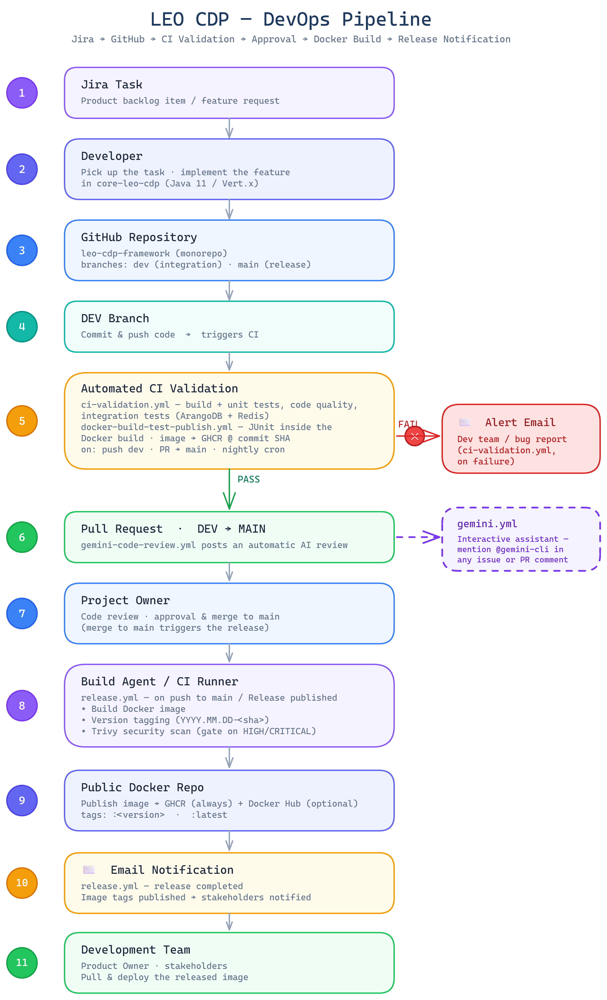

# GitHub Actions Workflows

CI/CD automation for the **LEO CDP framework**. The pipeline covers the full path
from a developer commit through validation, AI-assisted review, owner approval, and
the published Docker release.

All workflows are scoped to `core-leo-cdp` (the Java 11 / Vert.x backend) — the only
module in this monorepo with an automated build.

---

## The flow



> The diagram source is [flow.excalidraw](flow.excalidraw). Open it in the
> [Excalidraw VS Code extension](https://marketplace.visualstudio.com/items?itemName=pomdtr.excalidraw-editor)
> (or [excalidraw.com](https://excalidraw.com)) to edit, then **export as PNG** back
> to `flow.png` to keep this README in sync.

A vertical numbered flow, with each step mapped to the workflow file that powers it:

| # | Stage | Powered by |
|---|---|---|
| 1 | Jira Task | — |
| 2 | Developer | — |
| 3 | GitHub Repository (`leo-cdp-framework`) | — |
| 4 | DEV Branch — commit & push | — |
| 5 | Automated CI Validation → FAIL → Alert Email (red ✕) / PASS ↓ | `ci-validation.yml` + `docker-build-test-publish.yml` |
| 6 | Pull Request DEV → MAIN (+ `gemini.yml` interactive aside) | `gemini-code-review.yml` |
| 7 | Project Owner — review / approve / merge | — |
| 8 | Build Agent / CI Runner — build, version tag, Trivy scan | `release.yml` |
| 9 | Public Docker Repo — GHCR + Docker Hub | `release.yml` |
| 10 | Email Notification | `release.yml` |
| 11 | Development Team — stakeholders | — |

The pipeline follows eleven stages, **Jira → GitHub → CI Validation → Approval →
Docker Build → Release Notification**:

1. **Jira Task** — a product-backlog item / feature request.
2. **Developer** — picks up the task and implements the feature in `core-leo-cdp`.
3. **GitHub Repository** — `leo-cdp-framework`; `dev` is the integration branch, `main`
   is the release branch.
4. **DEV Branch** — the developer commits & pushes code, which triggers CI.
5. **Automated CI Validation** — **`ci-validation.yml`** (build + unit tests, code
   quality, integration tests against ArangoDB + Redis) and
   **`docker-build-test-publish.yml`** (JUnit inside the Docker build, image → GHCR
   tagged with the commit SHA) run on every push to `dev`, on PRs into `main`, and on
   a nightly cron.
   - **FAIL →** `ci-validation.yml` emails an alert to the dev team (bug report).
   - **PASS →** continue to the pull request.
6. **Pull Request `DEV → MAIN`** — opening it triggers **`gemini-code-review.yml`**,
   which posts an automatic AI code review (Google Gemini). *(Separately, **`gemini.yml`**
   lets anyone mention `@gemini-cli` in any issue or PR comment for an interactive
   assistant.)*
7. **Project Owner** — reviews, approves, and merges to `main`. The merge triggers the
   release.
8. **Build Agent / CI Runner** — **`release.yml`** derives a version tag, builds the
   Docker image, and runs a Trivy security scan (gated on HIGH/CRITICAL).
9. **Public Docker Repo** — publishes the image to GHCR (always) and Docker Hub
   (if credentials are configured), tagged `:<version>` and `:latest`.
10. **Email Notification** — `release.yml` emails the release notification.
11. **Development Team** — Product Owner and stakeholders pull & deploy the released
    image.

---

## The workflows

| File | Trigger | What it does |
|---|---|---|
| [`ci-validation.yml`](ci-validation.yml) | push to `dev`, PR into `main`, nightly cron (`18:00 UTC`), manual | Build + unit tests, code quality, integration tests (ArangoDB 3.11 + Redis 6 service containers). Emails the dev team on failure. |
| [`docker-build-test-publish.yml`](docker-build-test-publish.yml) | push to `main`/`dev`, PR touching `core-leo-cdp/**`, manual | Builds the Docker image running the JUnit suite inside the multi-stage build, publishes the JUnit report, and pushes the runtime image to GHCR tagged with the commit SHA (full + short). PRs build/test but don't push. |
| [`release.yml`](release.yml) | push to `main`, published GitHub Release, manual | Version tag (`YYYY.MM.DD-<shortsha>`), build, Trivy scan (fails on HIGH/CRITICAL), push `:version` + `:latest` to GHCR and optionally Docker Hub, then email stakeholders. |
| [`gemini.yml`](gemini.yml) | `@gemini-cli` in an issue/PR comment, review, or new issue | Runs Google's Gemini CLI against the repo to answer the request. Restricted to repo owners/members/collaborators; skipped silently if `GEMINI_API_KEY` is not configured. |
| [`gemini-code-review.yml`](gemini-code-review.yml) | every PR (same-repo and fork) | Automatic AI code review via the Gemini CLI `code-review` extension. Skipped silently if `GEMINI_API_KEY` is not configured. |

---

## Setup

### 1. Repository secrets

Add these under **Settings → Secrets and variables → Actions**. The pipeline degrades
gracefully — workflows skip the steps whose secrets are missing rather than failing.

| Secret | Used by | Required? | Notes |
|---|---|---|---|
| `GEMINI_API_KEY` | `gemini.yml`, `gemini-code-review.yml` | For AI workflows | Free key from [Google AI Studio](https://aistudio.google.com/apikey). Without it, both Gemini workflows skip cleanly. |
| `SMTP_HOST` | `ci-validation.yml`, `release.yml` | For email | SMTP server hostname. |
| `SMTP_PORT` | `ci-validation.yml`, `release.yml` | For email | e.g. `465` or `587`. |
| `SMTP_USER` | `ci-validation.yml`, `release.yml` | For email | SMTP username. |
| `SMTP_PASS` | `ci-validation.yml`, `release.yml` | For email | SMTP password / app password. |
| `DEV_TEAM_EMAILS` | `ci-validation.yml` | For failure alerts | Comma-separated recipients of CI-failure alerts. |
| `STAKEHOLDER_EMAILS` | `release.yml` | For release notices | Comma-separated recipients of release notifications. |
| `DOCKER_USERNAME` | `release.yml` | Optional | Enables Docker Hub publishing. Omit to publish to GHCR only. |
| `DOCKER_PASSWORD` | `release.yml` | Optional | Docker Hub access token. |

> `GITHUB_TOKEN` is provided automatically by GitHub Actions — no setup needed. It
> authenticates the GHCR push and lets the Gemini workflows comment on PRs/issues.

### 2. Permissions

- **GHCR publishing** needs `packages: write` (already declared in the release and
  docker workflows). Confirm **Settings → Actions → General → Workflow permissions**
  allows write access, or that the default `GITHUB_TOKEN` has package scope.
- **Docker Hub** image name defaults to `trieu/leo-cdp-framework` (see `DOCKERHUB_IMAGE`
  in [`release.yml`](release.yml)). Change it there if you fork.

### 3. Branch protection (recommended)

Protect `main` and require these status checks before merge:
- **CI Validation**
- **Docker Build, Test & Publish (core-leo-cdp)**
- **Gemini Code Review**

---

## Usage

### Day-to-day

- **Develop on `dev`.** Every push runs CI validation and a commit-tagged image build.
  Watch the run under the **Actions** tab; a failing `ci-validation` run emails the dev
  team.
- **Open a PR `dev → main`.** Gemini posts an automated review; the validation and
  docker build run as PR checks.
- **Ask `@gemini-cli` for help** by mentioning it in any PR or issue comment (e.g.
  *"@gemini-cli why is this test flaky?"* or `@gemini-cli /review` to re-run the review).
- **Merge to `main`** (owner only) to cut a release — the image is version-tagged,
  scanned, published, and stakeholders are emailed.

### Manual runs

All three build/validate workflows expose **`workflow_dispatch`** — trigger them from
**Actions → (workflow) → Run workflow**. `release.yml` additionally accepts a
`platforms` input (`linux/amd64` or `linux/amd64,linux/arm64`) for multi-arch builds.

### Pulling a published image

```bash
# Latest release
docker pull ghcr.io/<owner>/leo-cdp-framework:latest

# A specific commit (from docker-build-test-publish.yml)
docker pull ghcr.io/<owner>/leo-cdp-framework:<short-sha>
```

Replace `<owner>` with the GitHub org/user that owns this repository.
