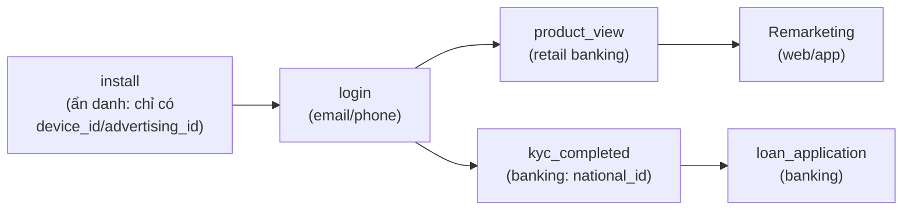
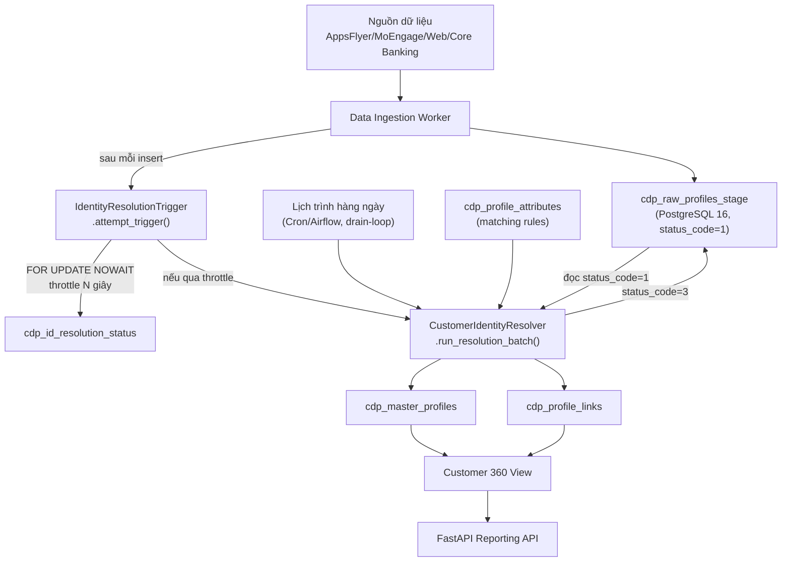

<!-- _class: lead -->

# Customer Identity Resolution (CIR)
## Trong nền tảng Customer 360

Giải pháp hợp nhất danh tính khách hàng đa nguồn
(AppsFlyer · MoEngage · Web Tracking · Core Banking)

---

## Nội dung

1. Giới thiệu Customer Identity Resolution trong Customer 360
2. Nền tảng dữ liệu: nguồn dữ liệu, hành trình khách hàng, thuộc tính hồ sơ
3. Kiến trúc chi tiết: thiết kế hệ thống, các bước xử lý, phương pháp ghép nối
4. Demo thực tế

---

# 1. Giới thiệu Customer Identity Resolution

---

## Vấn đề: dữ liệu khách hàng bị phân mảnh

Một khách hàng thực tế "chạm" vào doanh nghiệp qua **nhiều hệ thống độc lập**:

- **AppsFlyer** – attribution quảng cáo mobile (Facebook/TikTok/Google/Grab Ads…)
- **MoEngage** – engagement / marketing automation
- **Web Tracking** – cookie trên website và Google Analytics 4 (GA4)
- **Core Banking / KYC** – hệ thống lõi ngân hàng (retail & banking domain)
- **QR Code & Landing Page** - sự kiện offline (PR event, tại điểm bán…)

➡️ Mỗi hệ thống chỉ biết **một phần** của khách hàng → không có góc nhìn 360°.

---

## Customer Identity Resolution (CIR) là gì?

> **CIR** là quá trình **liên kết (link)** các bản ghi hồ sơ thô (raw profile) từ nhiều nguồn khác nhau, xác định chúng có **cùng thuộc về một khách hàng thực** hay không, và **hợp nhất (merge)** thành **một hồ sơ "vàng" duy nhất** (Golden/Master Profile).

**Mục tiêu trong Customer 360:**
- Một khách hàng = **một `master_profile_id`** duy nhất, xuyên suốt mọi kênh, mọi domain (retail/banking/travel)
- Nền tảng cho: personalization, chấm điểm (lead/churn/CLV), segmentation, báo cáo

---

## Vì sao Customer Identity Resolution (CIR) rất quan trọng?

- Người dùng VN dùng **nhiều app/thiết bị** (Zalo, app ngân hàng, app bán lẻ, web) → danh tính bị tách rời qua `device_id`, `cookie_id`, số điện thoại, email
- Ngân hàng số & bán lẻ đa kênh cần **tuân thủ dữ liệu cá nhân** (Nghị định 13/2023/NĐ-CP về bảo vệ dữ liệu cá nhân) → CIR phải xử lý PII đã **hash/ẩn danh**
- Chiến dịch marketing đa kênh (Facebook/TikTok/Google/Grab Ads) cần đo lường **hiệu quả thực sự trên một khách hàng**, không tính trùng theo từng thiết bị/click

---

# 2. Nền tảng dữ liệu

---

## Nguồn dữ liệu (Data Sources)

| Nguồn | Domain | Định danh mang theo |
|---|---|---|
| **AppsFlyer** | Mobile App | `device_id`, `advertising_id` (IDFA/GAID) |
| **MoEngage** | Mobile App | `external_customer_id`, `email`, `push_token` |
| **Web Tracking** | Landing Page | `cookie_id`, `email` |
| **Core Banking / KYC** | Core Banking | `phone_number`, `national_id`, `device_id` |

Tất cả đổ về **một bảng staging duy nhất**: `cdp_raw_profiles_stage`
(đa tenant – `tenant_id`, đa domain – `bán lẻ`/`banking`/`du lịch`)

---

## Hành trình khách hàng (Customer Journey Mapping)

Một khách hàng thực đi qua nhiều **điểm chạm (touchpoint)**, mỗi điểm chạm sinh ra **một raw profile riêng**:



- Điểm chạm đầu (`install`) **không có PII** — chỉ có định danh thiết bị/quảng cáo -> Anonymous Profile
- Các điểm chạm sau (`login`, `kyc_completed`…) **trên cùng thiết bị** mới có danh tính thật
- CIR phải **liên kết  các Anonymous Profile vào 1 Master Profile** → đây chính là cơ chế tạo ra "duplicate" cần hợp nhất

---

## Thuộc tính hồ sơ chính (Key Profile Attributes)

**Nhóm định danh thông tin cá nhân (luôn hash SHA-256 trước khi lưu — không lưu PII thô):**
`full_name`, `email`, `phone_number`, `national_id`

**Nhóm định danh thiết bị/quảng cáo (hợp nhất thành mảng trên master):**
`device_id → device_ids[]`, `advertising_id → advertising_ids[]`, `cookie_id → cookie_ids[]`

**Nhóm định danh theo hệ thống nguồn (hợp nhất thành JSONB theo `source_system`):**
`external_customer_id → external_ids{}`, `push_token → push_tokens{}`

**Metadata mô tả tất cả attribute:** bảng `cdp_profile_attributes` — 54 thuộc tính, gồm cả cấu hình *matching_rule*, *matching_threshold*, *consolidation_rule*, *is_pii*, *attribute_group* (SYSTEM/IDENTITY/RETAIL/BANKING/SCORING…)

---

# 3. Kiến trúc chi tiết

---

## Sơ đồ kiến trúc hệ thống



---

## Nguyên tắc thiết kế: Metadata-driven

- Quy tắc ghép nối **không hard-code trong code** mà đọc động từ bảng `cdp_profile_attributes`
- Mỗi thuộc tính khai báo: `is_identity_resolution`, `matching_rule`, `matching_threshold`
- Thêm/sửa quy tắc ghép nối = **UPDATE 1 dòng metadata**, không cần deploy lại code
- Resolver chỉ lấy các rule đang **ACTIVE** và có `matching_rule != 'none'`

```sql
SELECT attribute_internal_code, matching_rule, matching_threshold
FROM cdp_profile_attributes
WHERE is_identity_resolution = TRUE
  AND status = 'ACTIVE'
  AND matching_rule IS NOT NULL AND matching_rule != 'none';
```

---

## Các bước xử lý (Process Steps)

Cho mỗi batch (tối đa `batch_size` bản ghi, `status_code = 1`):

1. **Lấy quy tắc ghép nối đang active** từ `cdp_profile_attributes`
2. **Lấy batch raw profile** chưa xử lý, cùng `tenant_id`
3. Với mỗi raw profile → **`_find_master_profile()`**: build câu `WHERE` động (OR các điều kiện match), scope theo `tenant_id` + `domain`
4. **Có match** → `_link_and_update()`: insert `cdp_profile_links`, `UPDATE` master (COALESCE cho scalar, append-distinct cho mảng/JSONB)
5. **Không match** → `_create_master_and_link()`: tạo `cdp_master_profiles` mới + link
6. **Đánh dấu đã xử lý**: `status_code = 3`, `processed_at = NOW()`
7. `COMMIT` toàn batch — an toàn để **retry** (idempotent nhờ unique constraint `(tenant_id, raw_profile_id)`)

---

## Identity Resolution — Các phương pháp ghép nối

| Phương pháp | Dùng cho | Điều kiện |
| --- | --- | --- |
| **Exact Match** | `email`, `phone`, `national_id`, `full_name` (hash), `external_customer_id` | `col = value` |
| **Fuzzy (Trigram)** | Văn bản thô | `similarity >= threshold` |
| **Double Metaphone** | Họ tên phát âm gần giống | `dmetaphone(col) = dmetaphone(value)` |
| **Array Match** | `device_id`, `advertising_id`, `cookie_id` | `value = ANY(array)` |
| **JSONB Match** | `external_customer_id` theo từng nguồn | `external_ids @> {...}` |

---

## Identity Resolution — Bảo vệ PII & Chuẩn AdTech

### Chuẩn xử lý PII

- PII (`email`, `phone`, `national_id`, `full_name`) được **hash bằng SHA-256** trước khi lưu trữ.
- Chuẩn hóa dữ liệu (lowercase, trim, E.164...) **trước khi hash** để tăng tỷ lệ match.
- Cột `is_hashed BOOLEAN` trên `cdp_master_profiles` đánh dấu hồ sơ có PII đã hash.
- **Ràng buộc:** `is_hashed = TRUE` ⇒ `persona_name` **bắt buộc khác NULL** (CHECK constraint DB + tự sinh ở tầng Python — `persona.py`) — nhãn dễ đọc, không phải PII, thay thế `full_name` (giờ chỉ còn là hash) cho mục đích duyệt/tìm kiếm ngữ nghĩa. Ví dụ: `"Savvy Retail Shopper (TikTok Ads) #4f2a9c"`.

---

## Quy tắc ghép nối

| Loại dữ liệu | Phương pháp |
| --- | --- |
| **PII đã hash** | ✅ Exact Match |
| **Văn bản thô** | ✅ Fuzzy Match (Trigram, Double Metaphone) |

### Tham chiếu chuẩn ngành

- **Google Customer Match**: hỗ trợ upload PII đã hash bằng **SHA-256**.
- **Google Enhanced Conversions**: yêu cầu chuẩn hóa dữ liệu trước khi hash và đối sánh bằng giá trị hash.
- Mô hình này cũng được áp dụng rộng rãi trên các nền tảng AdTech/MarTech như **Meta Customer Match**.

**Reference**

- Google Customer Match  https://support.google.com/displayvideo/answer/9539301
- Google Enhanced Conversions https://support.google.com/adspolicy/answer/9755941

---

## Cơ chế Real-time vs Batch hàng ngày

**Real-time (throttled), không phải DB trigger thật:**
- Ingestion worker gọi `IdentityResolutionTrigger.attempt_trigger()` ngay sau insert
- Dùng `SELECT ... FOR UPDATE NOWAIT` trên `cdp_id_resolution_status` → khoá theo hàng, nhiều worker song song vẫn an toàn
- Nếu đã chạy trong N giây gần nhất → **bỏ qua** (throttle), không chặn luồng ingest
- Lỗi xử lý CIR **không làm crash** worker ingest (bắt exception, rollback)

**Batch hàng ngày (`daily_job.py`):**
- Drain-loop: lặp `run_resolution_batch()` cho đến khi staging hết bản ghi `status_code=1`
- Đảm bảo **không sót** bản ghi nếu real-time bị throttle bỏ qua liên tục

---

## Đa tenant & đa domain (Multi-tenant / Multi-domain)

- Mọi bảng đều có `tenant_id` — cách ly dữ liệu giữa các khách hàng doanh nghiệp (multi-tenant SaaS)
- `domain` phân biệt **retail** vs **banking** trong cùng một tenant → **không hợp nhất** hồ sơ giữa hai domain (một người có thể là khách bán lẻ và khách vay ngân hàng, được resolve **riêng**)
- Mọi câu query ghép nối luôn `WHERE tenant_id = %s AND domain = %s`
- `cdp_profile_links` có unique constraint `(tenant_id, raw_profile_id)`

---

# 4. Demo thực tế

---

## Kịch bản demo

`identity-resolution-service/run-demo.sh` — một lệnh, chạy toàn bộ pipeline:

1. Nạp cấu hình DB từ `.env`, dựng virtualenv, cài `requirements.txt`
2. **`init_sample_data.py`** — sinh **1.000 raw profile** AppsFlyer giả lập:
   - 6 kênh quảng cáo (Facebook/TikTok/Google/Grab/FPT Play Ads, PR offline)
   - Trộn domain retail/banking (40% banking)
   - ~30% là **"duplicate" có chủ đích**: sự kiện `login/purchase/kyc_completed` trên **cùng device** của một `install` ẩn danh trước đó
   - PII được **hash SHA-256** trước khi insert (không lưu dữ liệu thật)
3. **`run_demo_resolution.py`** — chạy `CustomerIdentityResolver` cho đến khi hết batch, in kết quả master profile

---

## Kết quả demo (đã verify thực tế)

| Chỉ số | Giá trị |
|---|---|
| Raw profiles đầu vào | **1.000** |
| Master profiles tạo ra | **700** |
| Master profile được hợp nhất (≥2 raw) | **243** |
| Tỷ lệ trùng chủ đích | 30% (`duplicate_rate`) |

➡️ Chuỗi `install (device_id)` → `login/kyc_completed (phone/email/national_id)` được **CIR nối lại đúng qua `device_id`**, dù `install` ban đầu hoàn toàn ẩn danh.

**Lưu ý kỹ thuật đã gặp:** phải đảm bảo `full_name`/`phone_number` sinh ngẫu nhiên **không trùng lặp giữa các khách hàng khác nhau** (rejection-sampling), nếu không resolver sẽ hợp nhất nhầm 2 người thật thành 1.

---

## Kiểm tra kết quả bằng SQL

```sql
-- Master profile theo domain (PII hiển thị là hash, persona_name là nhãn dễ đọc thay thế)
SELECT master_profile_id, domain, full_name, email, phone_number, is_hashed, persona_name, source_systems
FROM customer360.cdp_master_profiles
WHERE tenant_id = '11111111-1111-1111-1111-111111111111'
ORDER BY domain;

-- Trạng thái xử lý của từng raw profile
SELECT raw_profile_id, source_system, domain, status_code
FROM customer360.cdp_raw_profiles_stage
WHERE tenant_id = '11111111-1111-1111-1111-111111111111';

-- Liên kết raw -> master
SELECT * FROM customer360.cdp_profile_links
WHERE tenant_id = '11111111-1111-1111-1111-111111111111';
```

---

## Quan sát qua API báo cáo (customer360-api)

FastAPI + SQLAlchemy 2, phản chiếu đúng dữ liệu demo:

- `GET /api/v1/reporting/summary` — tổng số raw/master, tỷ lệ hợp nhất
- `GET /api/v1/reporting/master-profiles/duplicates` — các master được hợp nhất từ ≥2 raw profile
- `GET /api/v1/reporting/identity-graph/coverage` — độ phủ định danh (device/email/phone…) trên master profile

➡️ Cùng một nguồn sự thật (`customer360` schema) phục vụ cả **pipeline CIR** và **API báo cáo/ứng dụng**.

---

<!-- _class: lead -->

## Tổng kết

- CIR biến **N bản ghi rời rạc, đa nguồn, đa kênh** thành **1 hồ sơ khách hàng duy nhất**
- Thiết kế **metadata-driven**, **đa tenant/đa domain**, xử lý **real-time (throttled) + batch hàng ngày**
- PII được **hash trước khi lưu** — tuân thủ bảo vệ dữ liệu cá nhân
- Demo thực tế: **1.000 → 700** hồ sơ, verify end-to-end trên PostgreSQL 16 + pgvector

**Nền tảng cho:** Customer 360 · Segmentation · Personalization · Lead/Churn/CLV Scoring
