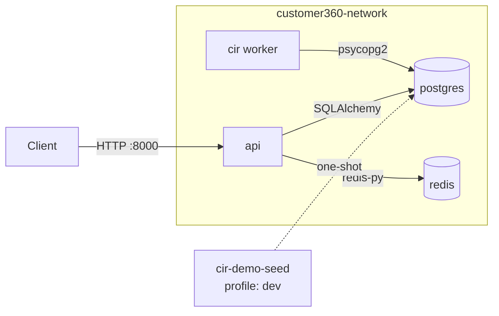

# Customer 360 Platform — Docker Compose Operations Guide

Audience: DevOps engineers deploying/operating the stack, and backend
engineers developing against it locally. Covers
[`docker-compose.yml`](docker-compose.yml) at the root of `core-customer360/`.

For architecture/DB schema background see [README.md](README.md),
[TECHNICAL-DOCUMENTATION.md](TECHNICAL-DOCUMENTATION.md), and
[identity-resolution.md](identity-resolution.md). This guide only covers the
containerized deployment.

---

## 1. What gets deployed

| Service | Image (built locally) | Role | Port (host) |
|---|---|---|---|
| `postgres` | `customer360-postgres:local` (postgis/postgis:16-3.5 + pgvector) | Primary datastore, auto-provisioned with [`database-schema.sql`](database-schema.sql) | `${POSTGRES_HOST_PORT:-5432}` → 5432 |
| `redis` | `customer360-redis:local` (redis:8-alpine) | Response cache for customer360-api | `${REDIS_HOST_PORT:-6379}` → 6379 |
| `cir` | `customer360-cir:local` (Python 3.11-slim) | Customer Identity Resolution worker — continuously drains `cdp_raw_profiles_stage` | none (background worker, no HTTP) |
| `api` | `customer360-api:local` (Python 3.11-slim) | Customer 360 / CIR REST API (FastAPI) | `${API_HOST_PORT:-8000}` → 8000 |
| `cir-demo-seed` | reuses `customer360-cir:local` | **Dev only** one-shot job that seeds demo data, then exits | none |

All services share one bridge network, `customer360-network`, and are isolated
from other Docker workloads on the host. Two named volumes persist state
across restarts: `customer360-pgdata` (Postgres data directory) and
`customer360-redisdata` (Redis AOF file).



---

## 2. Prerequisites

- Docker Engine + Docker Compose v2 (the `docker compose` plugin, not the
  legacy standalone `docker-compose` v1 binary — `depends_on.condition:
  service_healthy` requires the Compose Specification).
- Ports `5432` / `6379` / `8000` free on the host, **or** override them (see
  §4) — this matters on dev machines that already run `pgsql16_vector` /
  another Redis via [`dev-start-pgsql.sh`](dev-start-pgsql.sh).

---

## 3. First-time setup

```bash
cd core-customer360
cp .env.example .env
```

Edit `.env` and set real values for at least:

- `DB_PASSWORD` — Postgres password (used both to bootstrap the `postgres`
  container and by `api`/`cir` to connect).
- `REDIS_PASSWORD` — Redis `requirepass`, applied at container start.
- `GOOGLE_GENAI_API_KEY` — optional; leave the `YOUR_...` placeholder to keep
  CIR's persona-name generation fully offline/deterministic (see
  [identity-resolution.md](identity-resolution.md)).

`.env` is gitignored (see [`.gitignore`](.gitignore)) — never commit real
credentials. `.env.example` is the committed template.

> **How `.env` is used (important to understand before editing it):**
> 1. `docker-compose.yml` uses `${VAR}` substitution to seed the official
>    Postgres/Redis image bootstrap variables (`POSTGRES_USER`, `--requirepass`, etc.).
> 2. Every service also gets the whole file injected via `env_file:`, exactly
>    like `customer360-api`/`identity-resolution-service` read it for non-Docker
>    local dev (`pydantic-settings` / `python-dotenv`).
> 3. **`DB_HOST` / `REDIS_HOST` in `.env` are overridden by `docker-compose.yml`**
>    to the in-network service names (`postgres` / `redis`) for the
>    `api`/`cir`/`cir-demo-seed` containers, regardless of what's in the file.
>    The `localhost` defaults in `.env.example` are only correct when you run
>    `customer360-api`/`identity-resolution-service` directly on the host
>    (`./start.sh`, `./run-demo.sh`) against the dockerized Postgres/Redis via
>    their published host ports.

---

## 4. Running the stack

### Production mode (4 core services)

```bash
docker compose up -d --build
docker compose ps
```

Starts `postgres`, `redis`, `cir`, `api` only. First boot on a fresh
`customer360-pgdata` volume runs `postgres/init/00-extensions.sql` then the
full `database-schema.sql` automatically (Postgres' standard
`/docker-entrypoint-initdb.d/` mechanism — **only runs once**, on an empty
data directory; see §7 for schema changes afterward).

### Dev mode (core services + demo data)

```bash
docker compose --profile dev up -d --build
```

Same 4 services, **plus** `cir-demo-seed`, a one-shot job (`restart: "no"`)
that waits for `postgres` to be healthy, then runs, in order:

1. `scripts/init_sample_data.py` — seeds 1000 synthetic AppsFlyer raw profiles
   (retail + banking, ~30% deliberate duplicates).
2. `scripts/run_demo_resolution.py` — drains them through identity resolution.
3. `scripts/seed_full_demo_data.py` — seeds the full CRM journey graph,
   relations, transactions, behavioral events, and master-profile enrichment.

Check it completed successfully:

```bash
docker compose logs -f cir-demo-seed   # tail while running
docker inspect -f '{{.State.ExitCode}}' customer360-cir-demo-seed   # expect 0
```

It's idempotent (see [identity-resolution.md](identity-resolution.md) /
repo notes) — safe to re-run:

```bash
docker compose --profile dev up cir-demo-seed
```

### Overriding host ports (avoid clashing with other local Postgres/Redis)

In `.env`:

```dotenv
POSTGRES_HOST_PORT=15432
REDIS_HOST_PORT=16379
API_HOST_PORT=18000
```

Containers still talk to each other over `customer360-network` on the
standard internal ports (5432/6379/8000) — only the host-published mapping
changes.

### Building without starting, or rebuilding a single service

```bash
docker compose build                # all services
docker compose build api            # just customer360-api after a code change
docker compose up -d --no-deps api  # restart only api, don't touch its deps
```

---

## 5. Day-2 operations

### Health & status

```bash
docker compose ps
docker inspect -f '{{.State.Health.Status}}' customer360-postgres
docker inspect -f '{{.State.Health.Status}}' customer360-redis
docker inspect -f '{{.State.Health.Status}}' customer360-cir
docker inspect -f '{{.State.Health.Status}}' customer360-api
curl -s http://localhost:${API_HOST_PORT:-8000}/health
```

| Service | Healthcheck mechanism |
|---|---|
| `postgres` | `pg_isready -U $DB_USER -d $DB_NAME` |
| `redis` | `redis-cli -a $REDIS_PASSWORD ping` |
| `cir` | `python healthcheck.py` — raw psycopg2 connection test (no HTTP surface on this worker) |
| `api` | `python -c "urllib.request.urlopen('http://localhost:8000/health')"` |

All 4 use `restart: unless-stopped` — a crashed container (or one killed by
`docker restart`) comes back automatically; a deliberate `docker compose stop`
does not.

### Logs

```bash
docker compose logs -f api
docker compose logs -f cir            # look for "Processed N raw profile(s)"
docker compose logs -f postgres redis
```

### Stopping / restarting

```bash
docker compose stop            # stop containers, keep volumes/network
docker compose start           # resume
docker compose restart api     # just one service
docker compose down            # stop + remove containers (volumes kept)
docker compose down -v         # DESTRUCTIVE: also deletes customer360-pgdata/-redisdata
```

### Shelling in / ad-hoc SQL

```bash
docker exec -it -u postgres customer360-postgres psql -d customer360
docker exec -it customer360-redis redis-cli -a "$REDIS_PASSWORD" --no-auth-warning
docker exec -it customer360-api python -c "from core.database import engine; print(engine)"
```

### Scaling the API

`api` is stateless (session state lives in Postgres/Redis), so it can be
scaled horizontally behind a load balancer if needed:

```bash
docker compose up -d --no-deps --scale api=3 api
```
(Note: the fixed `container_name: customer360-api` and static host port
mapping in `docker-compose.yml` must be removed/parameterized first if you
actually intend to run >1 replica — as shipped it's meant for a single
instance per host.)

---

## 6. Configuration reference

All variables live in [`.env.example`](.env.example) — copy to `.env` and
tune per environment (dev/staging/prod). Highlights:

| Variable | Default | Notes |
|---|---|---|
| `DB_PASSWORD` | `change_me_postgres_password` | **Change in every real environment.** Also bootstraps the `postgres` container via `POSTGRES_PASSWORD`. |
| `REDIS_PASSWORD` | `change_me_redis_password` | **Change in every real environment.** Applied via `--requirepass`. |
| `CACHE_ENABLED` | `true` | Kill switch for the whole Redis caching layer in customer360-api (fails open regardless). |
| `CACHE_TTL_SECONDS` | `60` | Max staleness window for cached GET responses. Lower for tighter consistency, raise to cut DB load further. |
| `CIR_POLL_INTERVAL_SECONDS` | `30` | How often the `cir` worker polls `cdp_raw_profiles_stage` for unresolved rows. |
| `CIR_BATCH_SIZE` | `5000` | Rows per resolution batch. |
| `DB_POOL_SIZE` / `DB_MAX_OVERFLOW` | `10` / `20` | customer360-api SQLAlchemy pool sizing — tune with expected concurrent request volume. |
| `GOOGLE_GENAI_API_KEY` | placeholder | Leave as `YOUR_...` to keep CIR persona-name generation offline (see `identity_resolution/persona.py`). |

---

## 7. Schema changes / upgrades

`/docker-entrypoint-initdb.d/` scripts (extensions + `database-schema.sql`)
**only run once**, when `customer360-pgdata` is first created. This mirrors
the same limitation as [`dev-start-pgsql.sh`](dev-start-pgsql.sh)'s
`SCHEMA_VERSION` gate for non-Docker dev.

- **Fresh environment / OK to lose data (dev, CI):**
  ```bash
  docker compose down -v      # drops customer360-pgdata
  docker compose up -d --build
  ```
- **Existing environment with data to keep (staging/prod):** apply the DDL
  delta by hand against the running container, e.g.:
  ```bash
  docker cp database-schema.sql customer360-postgres:/tmp/database-schema.sql
  docker exec -u postgres customer360-postgres \
    psql -d customer360 -v ON_ERROR_STOP=1 -f /tmp/database-schema.sql
  ```
  (Only safe if every statement in the delta is `IF NOT EXISTS`/idempotent —
  review the diff first. This is the same caveat called out repeatedly for
  `dev-start-pgsql.sh` in this repo's history: plain `CREATE TABLE`/`ALTER
  TABLE ADD COLUMN` without `IF NOT EXISTS` will error against an
  already-provisioned database.)

After editing `postgres/init/00-extensions.sql` or the Dockerfile itself,
rebuild the image:
```bash
docker compose build postgres
```
(image rebuild alone does **not** re-run init scripts against an existing
volume — see above.)

---

## 8. Troubleshooting

| Symptom | Likely cause / fix |
|---|---|
| `failed to bind host port ... address already in use` | Another process (e.g. `pgsql16_vector`, a host Redis) already owns 5432/6379/8000. Set `POSTGRES_HOST_PORT`/`REDIS_HOST_PORT`/`API_HOST_PORT` in `.env` to unused ports. |
| `api`/`cir` stuck "waiting" / never healthy | Check `docker compose logs postgres` — if it never reaches healthy, the DB init script likely failed (bad `.env` values, or a non-idempotent manual schema edit). |
| `psycopg2.errors.UndefinedColumn` after editing `database-schema.sql` | Schema drift — the running volume was provisioned before your edit. See §7. |
| `NOAUTH Authentication required` from Redis | `REDIS_PASSWORD` mismatch between `.env` and what `api`/`redis` were started with — restart both after changing it (`docker compose up -d --force-recreate redis api`). |
| Reporting numbers look stale right after a write | Expected — reporting endpoints are TTL-cached only (no write-invalidation), bounded by `CACHE_TTL_SECONDS`. Also: the `cir` worker writes to Postgres directly (bypasses the API), so its writes never invalidate the API's cache either — same TTL bound applies. |
| Demo data missing after `docker compose up` (no `--profile dev`) | Expected — demo seeding only runs under the `dev` profile. Run `docker compose --profile dev up cir-demo-seed`. |

---

## 9. Relationship to the non-Docker local dev workflow

This Compose stack is independent of, and safe to run alongside, the existing
non-Docker dev scripts:

- [`dev-start-pgsql.sh`](dev-start-pgsql.sh) → container `pgsql16_vector`
- `customer360-api/start.sh` / `stop.sh` → runs uvicorn directly on the host
- `identity-resolution-service/run-demo.sh` → runs the CIR scripts directly on the host

They use different container names and (by default) the same host ports, so
only run one Postgres/Redis path at a time on a given port — or remap ports
as shown in §4/§8.
