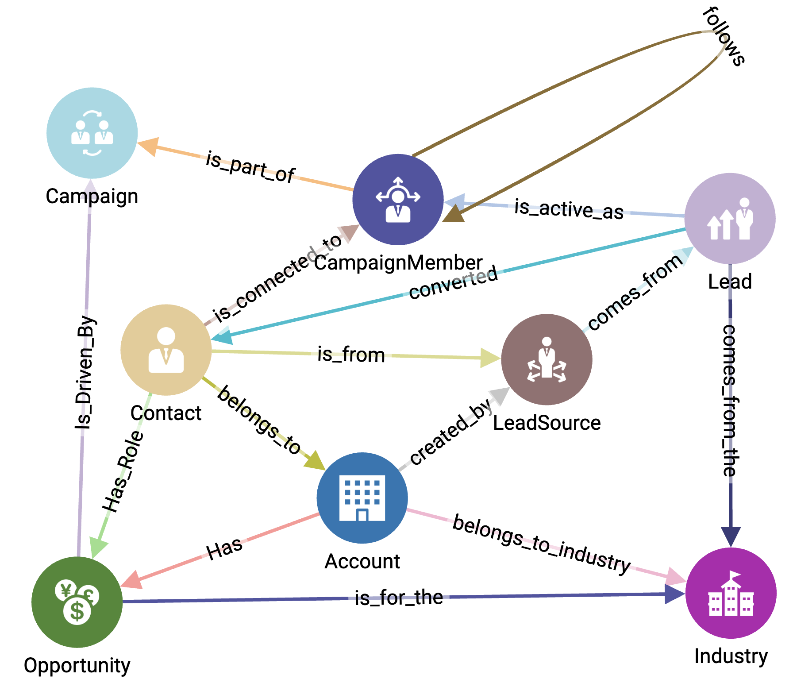

# Customer 360 with Journey Graph




Customer 360 provides a unified view of prospects, leads, and customers across the entire buying journey. The schema is modeled as a graph on PostgreSQL 16, extended with **pgvector** for semantic AI search and **PostGIS** for spatial intelligence.

---

## Why a Graph Schema?

Instead of looking at customers in isolation, the graph schema captures relationships and progression. A person can appear as a **Lead**, a **Campaign Member**, later become a **Contact**, and eventually be tied to an **Opportunity**. This lets you query across touchpoints and follow the full customer journey.

---

## Schema Overview

The schema has 8 vertex types (nodes) and 14 edge types (relationships).

**Vertex Types**

* **Account**: An organization that a Contact belongs to
* **Campaign**: A marketing initiative to generate Leads
* **CampaignMember**: A person who responds to a Campaign
* **Contact**: A Lead who is now associated with an Opportunity
* **Industry**: A business sector of an Account
* **Lead**: A person who is a potential buyer but not yet tied to an Opportunity
* **LeadSource**: A channel through which a Lead finds the product
* **Opportunity**: A potential sales transaction, with a monetary amount

**Edge Types** (examples)

* belongs\_to (Contact → Account)
* responds\_to (CampaignMember → Campaign)
* sourced\_from (Lead → LeadSource)
* converted\_to (Lead → Contact)
* associated\_with (Contact → Opportunity)
* in\_industry (Account → Industry)

---

## Customer Journey

The same real-world person can appear multiple times:

* As a **Lead** from a third-party source
* As a **Campaign Member** if they respond to marketing
* As a **Contact** when sales engages seriously
* Linked to an **Opportunity** with an Account

This models the **multi-stage journey** from prospect to buyer, which is essential in B2B contexts where decisions take time and involve multiple steps.

---

## Technology

* PostgreSQL 16
* `pgvector` extension for AI embeddings (semantic search, segmentation)
* `postgis` extension for geospatial queries
* Schema migrations tracked in a `schema_migrations` table
* Dockerized setup with an automated start script

---

## Example Queries

* Find all Contacts in the Finance industry influenced by Campaign X
* Retrieve all Leads that were converted to Contacts and then associated with more than one Opportunity
* Use vector search to segment “enterprise software buyers with high engagement”

1. Find all Contacts in the Finance industry that came from Campaign X
```sql
    SELECT c.contact_id, c.name
    FROM contacts c
    JOIN accounts a ON c.account_id = a.account_id
    JOIN industries i ON a.industry_id = i.industry_id
    JOIN campaign_members cm ON cm.contact_id = c.contact_id
    JOIN campaigns ca ON cm.campaign_id = ca.campaign_id
    WHERE i.name = 'Finance'
    AND ca.name = 'Campaign X';
```
2. Semantic Search: Contacts similar to "enterprise software buyers with >3 opportunities"

```sql
    SELECT contact_id, name
    FROM contacts
    ORDER BY embedding <-> (SELECT embedding FROM query_embeddings WHERE query_text = 'enterprise software buyers with >3 opportunities')
    LIMIT 10;
```

---

## Roadmap

* Core schema with 8 vertices and 14 edges
* Automated migrations with version tracking
* Event streaming integration (Firehose/Kafka) to populate Leads and Campaigns
* AI-powered customer segmentation using embeddings
* Graph-based dashboards for visualizing journeys

---

## References

* Salesforce Customer 360 Graph Model (adapted)
* pgvector project
* PostGIS documentation

