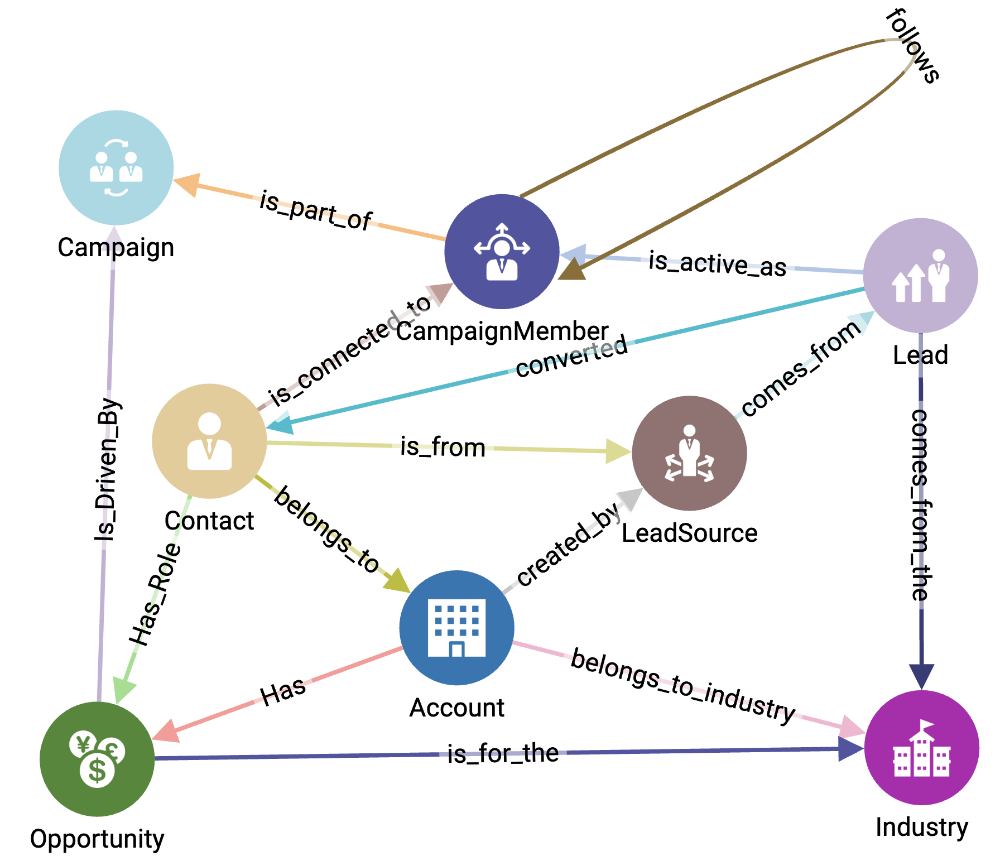
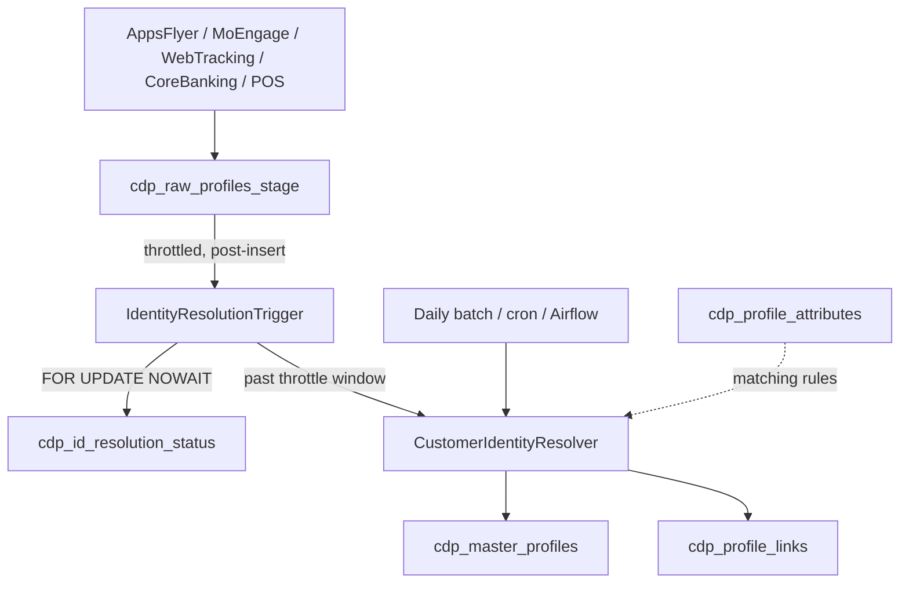

# Customer 360

Customer 360 is the **golden-record / identity-resolution layer** of LEO CDP: a PostgreSQL 16 schema (`customer360`) that consolidates customer identity and behavior across channels — AppsFlyer (mobile attribution), MoEngage (engagement), Web Tracking/GA4, POS, and Core Banking — plus a B2B **CRM journey graph** (Lead → Contact → Opportunity), a partitioned **behavioral event fact table**, and two runnable Python services that operate on the schema.



It ships as three independently runnable pieces:

| Component | Role | Tech |
|---|---|---|
| [`database-schema.sql`](database-schema.sql) | Single source of truth for the `customer360` schema | PostgreSQL 16, `pgvector`, `postgis`, `uuid-ossp`, `pgcrypto` |
| [`identity-resolution-service/`](identity-resolution-service) | **Customer Identity Resolution (CIR)** engine — links/merges raw profiles into master (golden) profiles | Python + psycopg2 |
| [`customer360-api/`](customer360-api) | REST API (CRUD + reporting) over the whole schema | FastAPI + SQLAlchemy 2 ORM |

`dev-start-pgsql.sh` stands up a local Docker container (`pgsql16_vector`, port 5432, db `customer360`) and applies `database-schema.sql`. Deeper docs: [TECHNICAL-DOCUMENTATION.md](TECHNICAL-DOCUMENTATION.md) (as-built architecture), [ROADMAP.md](ROADMAP.md), [identity-resolution.md](identity-resolution.md), and the [CIR tech talk slides](CIR-Tech-Slides-VN.md) (Vietnamese).

---

## Why a graph + golden-record schema?

Two problems are solved on the same schema:

1. **Fragmented identity** — a real customer touches AppsFlyer (install), MoEngage (push), Web Tracking (cookie), and Core Banking (KYC) as *separate, disconnected raw records*. **Identity Resolution (CIR)** links and merges these into one `cdp_master_profiles` row per real person.
2. **Multi-stage B2B journey** — the same person can appear as a **Lead**, a **Campaign Member**, later a **Contact**, and eventually be tied to an **Opportunity**. The **CRM journey graph** models that progression so you can query across touchpoints.

Both are multi-tenant (`tenant_id` on every table) and multi-domain (`domain`: `retail` / `banking` / `real_estate` / `travel` — a person is resolved *separately* per domain, e.g. retail shopper vs. bank customer).

---

## Data model

### 1. Golden Record & Identity Resolution (CIR)

| Table | Purpose |
|---|---|
| `cdp_raw_profiles_stage` | Landing zone for every inbound source (AppsFlyer/MoEngage/WebTracking/CoreBanking/POS/...). Carries per-source identity (`external_customer_id`, `device_id`, `advertising_id`, `cookie_id`, `ga_client_id`, `national_id`, ...) plus marketing attribution (`media_source`, `utm_*`) and a processing-queue `status_code` (1 new → 3 processed). |
| `cdp_master_profiles` | The **golden/resolved profile**: demographics, consolidated identity graph (`external_ids` JSONB, `device_ids`/`advertising_ids`/`cookie_ids` arrays, `push_tokens`), retail attrs (`loyalty_id`, `membership_tier`), banking attrs (`national_id`, `cif_number`, `account_numbers`, `kyc_status`, `risk_segment`), marketing/persona fields, lineage (`source_systems`, `first_seen_raw_profile_id`), and a full **ML scoring block** (see below). `status_code`: 1 active / 0 inactive / -1 deleted. |
| `cdp_profile_links` | Join table recording every `raw_profile_id → master_profile_id` link with `match_score`/`match_method`; unique per `(tenant_id, raw_profile_id)`. |
| `cdp_profile_attributes` | **Metadata-driven attribute catalog** (56 rows) — one row per `cdp_master_profiles` column plus the raw-stage matching keys, grouped by `attribute_group` (SYSTEM/IDENTITY/IDENTITY_GRAPH/RETAIL/BANKING/MARKETING/LINEAGE/*_SCORING/DATA_QUALITY). Drives CIR matching rules (`is_identity_resolution`, `matching_rule`: `exact`/`fuzzy_trgm`/`fuzzy_dmetaphone`/`none`, `matching_threshold`, `consolidation_rule`) *without hard-coding rules in application code*. |

**ML scoring columns on `cdp_master_profiles`** (schema-ready, filled by external pipelines): Lead & Conversion (`lead_conversion_probability`, `lead_grade`), Churn (`churn_probability`, `churn_risk_tier`), Customer Lifetime Value (`historical_clv`, `predictive_clv`, `clv_segment`), Customer Experience (`engagement_score`, `latest_nps_score`, `average_csat`, `overall_sentiment_score`), and Data Quality (`profile_completeness_score`, `identity_confidence_score`, `model_versions`, `scores_updated_at`).

**PII & persona handling**: `email`/`phone_number`/`full_name`/`national_id` are matched by CIR as **SHA-256 hashed** values (Google Customer Match / Enhanced Conversions pattern) — see `is_hashed BOOLEAN`. Whenever `is_hashed = TRUE`, a human-readable, non-PII `persona_name` (e.g. *"Savvy Retail Shopper (TikTok Ads) #4f2a9c"*) is auto-generated (optionally via Google GenAI/Gemini, with an offline deterministic fallback) and is **required** by a DB `CHECK` constraint (`chk_cdp_mp_hashed_requires_persona_name`).

### 2. Behavioral events

| Table | Purpose |
|---|---|
| `cdp_raw_events` | High-volume behavioral/transactional fact table, **range-partitioned monthly by `event_time`** (auto-bootstrapped ±3/+12 months via `ensure_cdp_raw_events_partition()`, with a `DEFAULT` catch-all partition). Carries identity columns directly on the row (`device_id`, `advertising_id`, `cookie_id`, `external_customer_id`, `session_id`) so ingestion never blocks on identity resolution; `master_profile_id`/`raw_profile_id` are backfilled asynchronously. Includes `event_category`/`event_name`, `is_conversion`, a generic `entity_type`/`entity_id`, `event_value`/`currency`, transaction linkage, and optional `geo_location` (PostGIS `GEOGRAPHY(POINT)`). |
| `cdp_event_catalog` | Governed vocabulary of `event_category`/`event_name` pairs (50 seeded events) across `GENERAL`, `FEEDBACK`, `COMMERCE` (retail), `FINANCE`/`STOCK_TRADING` (banking), `TRAVEL`, and `REAL_ESTATE` — mirrors `leotech.cdp.domain.schema.BehavioralEvent` in `core-leo-cdp`. Not FK-enforced (so ingestion is never blocked by a missing catalog row); used for discoverability/governance. |

### 3. CRM journey graph (B2B)

8 vertex types and their relationships model the prospect-to-buyer journey:

* **Lead** — a potential buyer not yet tied to an Opportunity, sourced via **LeadSource**
* **Campaign** / **CampaignMember** — a marketing initiative and the people who respond to it
* **Contact** — a Lead engaged seriously by sales, belonging to an **Account**
* **Account** — an organization, classified by **Industry**
* **Opportunity** — a potential sales transaction with a monetary `value`/`stage`/`close_date`

Every entity carries `description`/`keywords`/`embedding vector(1536)` for semantic search/segmentation.

### 4. Relations, interactions & general graph edges

| Table | Purpose |
|---|---|
| `relation_types` / `cdp_relations` | Typed relationships between two master profiles (e.g. `friend`, `family`, `customer-contact`). |
| `customer_contacts` | Interaction log (contact type/channel/content/date) per master profile. |
| `purchases` | Simple purchase fact per master profile (product, amount, currency, date). |
| `graph_edges` | General-purpose graph edge table, **list-partitioned by `relation`** (e.g. `belongs_to`, `converted`, `follows`, `has_role`, `is_connected_to`, ... plus a catch-all `DEFAULT` partition), with its own `embedding vector(1536)` for relationship-aware semantic search. |

---

## Customer Identity Resolution (CIR) — how it works


```mermaid
graph TD
    A[AppsFlyer / MoEngage / WebTracking / CoreBanking / POS] --> B[cdp_raw_profiles_stage]
    B -- "throttled, post-insert" --> T[IdentityResolutionTrigger]
    T -- "FOR UPDATE NOWAIT" --> ST[cdp_id_resolution_status]
    T -- "past throttle window" --> R[CustomerIdentityResolver]
    S[Daily batch / cron / Airflow] --> R
    M[cdp_profile_attributes] -. matching rules .-> R
    R --> E[cdp_master_profiles]
    R --> F[cdp_profile_links]
```

1. **Ingest** raw events/profiles into `cdp_raw_profiles_stage` (`status_code = 1`).
2. **Resolve** in batches: `CustomerIdentityResolver` reads *active* matching rules from `cdp_profile_attributes` (exact / fuzzy trigram / double metaphone / array-membership for device/ad/cookie ids / JSONB containment for `external_ids`), scoped by `tenant_id` + `domain`.
3. **Match or create**: on match, the master profile is updated (`COALESCE` for scalars, append-distinct for arrays/JSONB) and a `cdp_profile_links` row is written; on no match, a new `cdp_master_profiles` row is created.
4. **Mark processed** (`status_code = 3`) and commit — idempotent/safe to retry via the unique `(tenant_id, raw_profile_id)` constraint.
5. Runs both **throttled real-time** (`IdentityResolutionTrigger`, called explicitly by the ingestion worker, not a real DB trigger) and as a **daily drain-loop batch** (`daily_job.py`) so nothing is missed if real-time was throttled.

Run the end-to-end demo (seeds 1,000 synthetic AppsFlyer-driven raw profiles across 6 ad channels/retail+banking domains with a controlled ~30% duplicate rate, then resolves them):

```bash
cd identity-resolution-service
./run-demo.sh
```

---

## Getting started

```bash
# 1. Start PostgreSQL 16 + pgvector + PostGIS and apply database-schema.sql
./dev-start-pgsql.sh            # first run: creates container + applies schema
./dev-start-pgsql.sh reset -y   # destructive: drop/recreate customer360 DB from scratch (dev only)

# 2. Run the CIR demo (seeds data + resolves identities)
cd identity-resolution-service && ./run-demo.sh

# 3. Run the REST API
cd ../customer360-api && ./start.sh   # docs at http://localhost:8000/docs
```

`customer360-api` exposes CRUD for every table above plus reporting endpoints:
- `GET /api/v1/reporting/summary` — raw vs. master profile counts, merge rate
- `GET /api/v1/reporting/master-profiles/duplicates` — masters resolved from ≥2 raw profiles
- `GET /api/v1/reporting/identity-graph/coverage` — identity-graph coverage (device/email/phone/...)

---

## Example queries

```sql
-- Master profiles by domain (PII shown as a hash; persona_name is the readable label)
SELECT master_profile_id, domain, full_name, email, phone_number, is_hashed, persona_name, source_systems
FROM customer360.cdp_master_profiles
WHERE tenant_id = '11111111-1111-1111-1111-111111111111'
ORDER BY domain;

-- Contacts in the Finance industry sourced from Campaign X
SELECT c.contact_id, c.first_name, c.last_name
FROM customer360.contact c
JOIN customer360.account a ON c.account_id = a.account_id
JOIN customer360.industry i ON a.industry_id = i.industry_id
JOIN customer360.campaign_member cm ON cm.contact_id = c.contact_id
JOIN customer360.campaign ca ON cm.campaign_id = ca.campaign_id
WHERE i.name = 'Finance' AND ca.name = 'Campaign X';

-- Semantic search: contacts similar to a free-text query embedding
SELECT contact_id, first_name, last_name
FROM customer360.contact
ORDER BY embedding <-> '[...]'::vector
LIMIT 10;
```

---

## Roadmap

See [ROADMAP.md](ROADMAP.md) for near/mid/long-term plans: API auth, a real ingestion layer (Kafka/PubSub), a true DB-trigger/event-driven real-time path, ML scoring pipelines for the scoring columns, automated embedding generation, an operational CIR dashboard, real fuzzy matching, and semantic/lookalike segmentation.

## References

* Salesforce Customer 360 Graph Model (adapted) — inspiration for the Lead/Campaign/Contact/Account/Opportunity journey graph.
* [LEO CDP 1.0](../core-leo-cdp) (ArangoDB 3.11-based) — the sibling CDP module in this monorepo; `cdp_event_catalog`'s event vocabulary is adapted from its [`BehavioralEvent`](../core-leo-cdp/src/main/java/leotech/cdp/domain/schema/BehavioralEvent.java) taxonomy so events stay consistent whether they land in ArangoDB or here in Postgres.
* [pgvector](https://github.com/pgvector/pgvector) / [PostGIS](https://postgis.net/)
* Google Customer Match / Enhanced Conversions (hashed-PII matching pattern)

