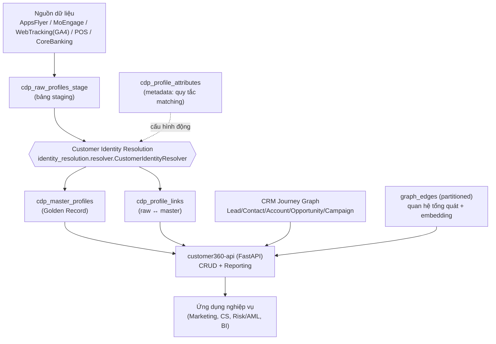

# Tài Liệu Kỹ Thuật — Customer 360 Platform

> Phạm vi tài liệu: mô tả **hiện trạng** (as-built) của module `core-customer360` trong monorepo `leo-cdp-framework` — kiến trúc, mô hình dữ liệu, tính năng, API, và các use case đang được hỗ trợ. Tài liệu được viết dựa trên mã nguồn thực tế (`database-schema.sql`, `identity-resolution-service/`, `customer360-api/`), không phải kế hoạch (Roadmap hiện tại chưa có nội dung — xem mục 9).

---

## 1. Tổng Quan

**Customer 360** là module cung cấp **hồ sơ khách hàng hợp nhất (golden record)** trên nền **PostgreSQL 16**, mở rộng bằng `pgvector` (semantic search / AI embeddings) và `PostGIS`/graph model (hành trình khách hàng đa giai đoạn). Module gồm 3 phần triển khai độc lập:

| Thành phần | Vai trò | Công nghệ |
|---|---|---|
| `database-schema.sql` | Schema PostgreSQL trung tâm (nguồn sự thật duy nhất — *single source of truth*) | PostgreSQL 16, pgvector, uuid-ossp, pgcrypto |
| `identity-resolution-service/` | Engine **Customer Identity Resolution (CIR)** — hợp nhất hồ sơ thô thành hồ sơ master | Python (psycopg2, OOP) |
| `customer360-api/` | REST API (CRUD + reporting) trên toàn bộ schema | FastAPI + SQLAlchemy 2 ORM |

Hai domain nghiệp vụ được hỗ trợ song song trên cùng schema: **`retail`** (bán lẻ/e‑commerce) và **`banking`** (ngân hàng số), phân biệt qua cột `domain` và cách ly dữ liệu theo `tenant_id` (multi-tenant).

---

## 2. Kiến Trúc Tổng Thể



- **Ingestion**: dữ liệu thô (mỗi request/event từ nguồn) được ghi vào `cdp_raw_profiles_stage` — không có logic hợp nhất tại bước này.
- **Identity Resolution**: một tiến trình Python (`CustomerIdentityResolver`) đọc các bản ghi `status_code = 1` (mới), áp quy tắc khớp (matching rule) đọc **động** từ `cdp_profile_attributes`, rồi tạo/khớp vào `cdp_master_profiles`, ghi log liên kết vào `cdp_profile_links`, và đánh dấu `status_code = 3` (đã xử lý).
- **API layer**: `customer360-api` là lớp truy cập dữ liệu duy nhất cho ứng dụng bên ngoài — CRUD đầy đủ trên tất cả các bảng + endpoint reporting tổng hợp.
- **CRM Journey Graph**: mô hình đồ thị riêng (Lead → CampaignMember → Contact → Opportunity → Account) mô phỏng hành trình B2B, độc lập với luồng CIR nhưng dùng chung API và schema.

---

## 3. Ngăn Xếp Công Nghệ

- **PostgreSQL 16** — cơ sở dữ liệu trung tâm, multi-model (quan hệ + JSONB + array + graph qua bảng partition).
- **pgvector** — lưu embedding (`vector(768)` cho `persona_embedding` hồ sơ khách hàng, `vector(1536)` cho các thực thể CRM và `graph_edges`) phục vụ semantic search / lookalike.
- **Extensions**: `uuid-ossp`, `pgcrypto` (schema chính); `citext`, `fuzzystrmatch`, `pg_trgm` (được tài liệu hoá cho fuzzy matching trong CIR, xem [identity-resolution.md](identity-resolution.md)).
- **Python 3 (psycopg2 + RealDictCursor)** — engine CIR (`identity-resolution-service/`), không phụ thuộc ORM để tối ưu hiệu năng batch.
- **FastAPI + SQLAlchemy 2 (typed ORM: `Mapped`/`mapped_column`) + Pydantic** — `customer360-api/`, expose REST API cho toàn bộ schema.
- **Docker** — `dev-start-pgsql.sh` khởi tạo container `pgsql16_vector` (port 5432, db `customer360`, user/pass `postgres`/`password`) và apply `database-schema.sql`.

---

## 4. Mô Hình Dữ Liệu (`database-schema.sql`)

Toàn bộ bảng nằm trong schema `customer360`. Có thể nhóm thành 4 khối:

### 4.1. CRM / Customer Journey Graph (8 vertex)

| Bảng | Mục đích | Khóa chính |
|---|---|---|
| `campaign` | Chiến dịch marketing | `campaign_id` |
| `campaign_member` | Người phản hồi một chiến dịch | `campaign_member_id` |
| `lead` | Khách hàng tiềm năng (chưa gắn Opportunity) | `lead_id` |
| `lead_source` | Kênh mà Lead đến từ đó | `lead_source_id` |
| `contact` | Lead đã gắn với Account/Opportunity | `contact_id` |
| `account` | Tổ chức mà Contact thuộc về | `account_id` |
| `opportunity` | Giao dịch bán hàng tiềm năng (có giá trị tiền) | `opportunity_id` |
| `industry` | Ngành nghề của Account | `industry_id` |

Mỗi bảng đều có `description`, `keywords TEXT[]`, `embedding vector(1536)`, `metadata JSONB` — chuẩn hoá cho semantic search / gắn thẻ AI trên toàn bộ CRM graph.

### 4.2. Customer Identity Resolution (CIR) — lõi Customer 360

| Bảng | Mục đích |
|---|---|
| `cdp_raw_profiles_stage` | Bảng staging — mỗi dòng là 1 event/bản ghi thô từ 1 nguồn (`source_system`: AppsFlyer, MoEngage, WebTracking, CoreBanking, POS…), gồm định danh PII (`full_name`, `email`, `phone_number`, `national_id`), định danh thiết bị/marketing (`device_id`, `advertising_id`, `cookie_id`, `ga_client_id`), thuộc tính UTM/attribution, `event_name/event_time/event_payload`, và `status_code` điều khiển hàng đợi xử lý (1=mới, 2=đang xử lý, 3=đã xử lý, 0=inactive, -1=xoá). |
| `cdp_master_profiles` | **Golden record** — hồ sơ khách hàng đã hợp nhất. Gồm 7 nhóm cột: (1) định danh & demographic (PII, gồm `is_hashed` — đánh dấu PII đã bị hash SHA-256 hay chưa — và `persona_name` — nhãn dễ đọc, không phải PII, **bắt buộc phải có khi `is_hashed = TRUE`**, do tầng ứng dụng tự sinh, xem 4.2.2), (2) identity graph đa kênh (`external_ids` JSONB, `device_ids`/`advertising_ids`/`cookie_ids` TEXT[], `push_tokens`), (3) thuộc tính riêng **retail** (`loyalty_id`, `membership_tier`, `preferred_store_code`), (4) thuộc tính riêng **banking** (`national_id`, `cif_number`, `account_numbers`, `kyc_status`, `risk_segment`), (5) marketing/engagement (`acquisition_source/campaign`, `persona_name`, `persona_embedding vector(768)`, `segmentation_tags`, `attributes JSONB`), (6) lineage (`source_systems`, `first_seen_raw_profile_id`), (7) **ML scoring** (xem 4.2.1). |
| `cdp_profile_links` | Bảng liên kết N–1: mỗi `raw_profile_id` (unique theo tenant) trỏ tới đúng 1 `master_profile_id`, kèm `match_score`, `match_method`. Dùng để truy vết & audit việc hợp nhất. |
| `cdp_profile_attributes` | **Metadata catalog** (54 dòng seed) — định nghĩa toàn bộ thuộc tính có thể xuất hiện trên `cdp_master_profiles` (tên, nhóm, kiểu dữ liệu, PII hay không) **và** cấu hình động cho CIR: `is_identity_resolution`, `matching_rule` (`exact`/`fuzzy_trgm`/`fuzzy_dmetaphone`/`none`), `matching_threshold`, `consolidation_rule`, `master_profile_column`. Đây là cơ chế "metadata-driven" cho phép thêm/sửa quy tắc khớp **không cần sửa code**. |
| `cdp_id_resolution_status` | Bảng trạng thái/throttle cho tiến trình xử lý real-time (không phải trigger DB thật — được gọi tường minh bởi ingestion worker). |

**4.2.1. Nhóm cột ML Scoring trên `cdp_master_profiles`** (do pipeline/ML tính bất đồng bộ, ghi vào `model_versions` + `scores_updated_at`):

- **Lead & Conversion**: `lead_conversion_probability`, `lead_grade`.
- **Churn**: `churn_probability`, `churn_risk_tier` (`low/medium/high/critical`).
- **CLV**: `historical_clv`, `predictive_clv`, `clv_segment`.
- **CX/Engagement**: `engagement_score`, `latest_nps_score`, `average_csat`, `overall_sentiment_score`.
- **Data Quality**: `profile_completeness_score`, `identity_confidence_score`.

> ⚠️ Các cột ML scoring hiện là **chỗ chứa dữ liệu** (schema đã sẵn sàng) — logic tính toán (model huấn luyện, batch job) **chưa có trong repo này**; xem mục 9 (Hạn chế).

**4.2.2. `is_hashed` / `persona_name` — nhãn thay thế khi PII đã bị hash:**

- `is_hashed BOOLEAN` đánh dấu `full_name`/`email`/`phone_number`/`national_id` của hồ sơ đã bị **SHA-256 hash** (không còn đọc được) hay chưa.
- **Ràng buộc nghiệp vụ**: khi `is_hashed = TRUE` thì `persona_name` **bắt buộc phải khác NULL** — được ép ở **2 tầng**: (1) CHECK constraint `chk_cdp_mp_hashed_requires_persona_name` trên bảng `cdp_master_profiles`, và (2) tầng ứng dụng — `identity-resolution-service/identity_resolution/persona.py` tự phát hiện PII trông giống hash (regex 64 ký tự hex) và **tự sinh `persona_name`** (nhãn dễ đọc, không PII, ví dụ `"Savvy Retail Shopper (TikTok Ads) #4f2a9c"`) một cách **xác định (deterministic)** dựa trên `domain` + kênh acquisition + một định danh không-PII ổn định (`device_id`/`advertising_id`/…), *không bao giờ* dùng lại/giải mã giá trị PII gốc.
- Lý do: một khi PII đã hash, `full_name` không còn giá trị hiển thị/tìm kiếm ngữ nghĩa (semantic search/admin UI) — `persona_name` lấp khoảng trống đó.
- `resolver.py` gọi lại logic này ở **cả 2 nơi** tạo/cập nhật master profile (`_create_master_and_link` và `_link_and_update`), nên `persona_name` luôn được điền ngay khi có bất kỳ raw profile nào mang PII trông giống hash được hợp nhất vào.
- **Tùy chọn Google Gemini**: nếu `GOOGLE_GENAI_API_KEY` được cấu hình (`.env`), `persona.py` gọi Gemini (`google-genai` SDK) để sinh nhãn sáng tạo hơn, chỉ gửi `domain` + kênh acquisition trong prompt (không bao giờ gửi PII/hash giá trị thật). Nếu không cấu hình key, không cài SDK, hoặc gọi API lỗi/timeout (giới hạn `GOOGLE_GENAI_TIMEOUT_MS`, mặc định 8s) — hàm tự động chuyển sang bộ sinh nhãn **offline, xác định (deterministic)**, không bao giờ raise exception hay chặn batch CIR.

### 4.3. Quan hệ & Tương tác (Relations & Events)

| Bảng | Mục đích |
|---|---|
| `relation_types` | Danh mục loại quan hệ giữa 2 master profile (`friend`, `colleague`, `family`, `customer-contact`…) |
| `cdp_relations` | Quan hệ N–N giữa 2 `cdp_master_profiles` (ví dụ: liên kết thành viên gia đình trong hộ gia đình ngân hàng) |
| `customer_contacts` | Log tương tác (CS, call center, email…) gắn với 1 master profile |
| `purchases` | Log giao dịch mua hàng gắn với 1 master profile |

### 4.4. Graph Edges (đồ thị tổng quát, có partition)

`graph_edges` là bảng cạnh (edge) tổng quát, **partition theo `relation`** (14 loại: `belongs_to`, `comes_from`, `converted`, `follows`, `is_part_of`, `is_active_as`, `is_connected_to`, `is_from`, `created_by`, `is_driven_by`, `has_role`, `has`, `is_for_the`, `belongs_to_industry`, + partition `other` mặc định). Mỗi cạnh có `embedding vector(1536)` — cho phép semantic search trên chính cấu trúc quan hệ, không chỉ trên node.

---

## 5. Tính Năng Hiện Tại (Features)

### 5.1. Customer Identity Resolution (CIR) — tính năng lõi
- Hợp nhất hồ sơ từ nhiều nguồn (AppsFlyer, MoEngage, WebTracking, CoreBanking, POS…) thành 1 golden record duy nhất.
- **Quy tắc khớp cấu hình động** qua `cdp_profile_attributes` (không hard-code trong Python): khớp chính xác (exact) trên `email`/`phone_number`/`national_id`/`full_name` (đã hash SHA-256 để bảo vệ PII), khớp qua **identity graph đa kênh** (`device_id`→`device_ids`, `advertising_id`→`advertising_ids`, `cookie_id`→`cookie_ids` dạng TEXT[]; `external_customer_id`→`external_ids` dạng JSONB theo từng `source_system`).
- Phân vùng theo `tenant_id` (đa khách hàng SaaS) và `domain` (`retail`/`banking`) — một khách hàng banking và một khách hàng retail không thể vô tình bị khớp chéo.
- Cơ chế throttle/trigger real-time (`cdp_id_resolution_status`) + job batch hằng ngày (`daily_job.py`) — mô phỏng kiến trúc production (Kafka/PubSub → staging → resolver → 2AM batch sweep), chi tiết luồng xem [identity-resolution.md](identity-resolution.md).
- PII được **hash trước khi lưu** (full_name/email/phone_number/national_id qua SHA-256 chuẩn hoá) trong dữ liệu demo — giảm rủi ro lộ dữ liệu nhạy cảm khi test. Khi đó `is_hashed = TRUE` và `persona_name` được **tự động sinh** (xem 4.2.2) để hồ sơ vẫn có nhãn dễ đọc phục vụ tìm kiếm/segmentation.

### 5.2. CRM & Customer Journey (B2B)
- Mô hình hành trình đa giai đoạn: Lead → Campaign Member → Contact → Opportunity, gắn với Account/Industry.
- Mỗi thực thể có sẵn `embedding vector(1536)` + `keywords` → sẵn sàng cho truy vấn ngữ nghĩa (semantic search) trên toàn bộ CRM graph.

### 5.3. Reporting / Analytics API
- Endpoint tổng hợp real-time: tổng số raw/master profile, funnel xử lý (pending/in-progress/processed), breakdown theo domain và theo source system, số lượng master profile "duplicate" (được hợp nhất từ ≥2 raw profile).
- Endpoint đo **độ phủ identity graph** (identity graph coverage): tỷ lệ master profile có email/phone/device/advertising id/cookie/external id/national id.

### 5.4. Semantic Search / AI-ready (pgvector)
- Toàn bộ thực thể CRM, `graph_edges`, và `persona_embedding` trên master profile đều có cột `vector` — sẵn sàng cho truy vấn tương tự bằng khoảng cách vector (`<->`), phục vụ segmentation ngữ nghĩa và lookalike modeling (xem ví dụ SQL trong [README.md](README.md)).

### 5.5. Đa tenant, đa domain
- Toàn bộ bảng CIR đều có `tenant_id` — cách ly dữ liệu multi-tenant ở tầng schema (không chỉ ở tầng ứng dụng).
- Cột `domain` (`retail`/`banking`) cho phép 1 schema phục vụ 2 loại nghiệp vụ khác nhau với các cột đặc thù riêng (loyalty vs. KYC/CIF).

### 5.6. REST API đầy đủ (CRUD + Reporting)
- `customer360-api` (FastAPI) expose toàn bộ các bảng trên qua REST, tài liệu OpenAPI tự sinh tại `/docs`.

---

## 6. API Reference (`customer360-api`)

Base URL mặc định: `http://localhost:8000`. Toàn bộ route nghiệp vụ nằm dưới tiền tố `/api/v1`. Tài liệu tương tác: `GET /docs` (Swagger UI), `GET /openapi.json`.

### 6.0. Health & Root

| Method | Path | Mô tả |
|---|---|---|
| GET | `/` | Thông tin service (`status`, link `/docs`) |
| GET | `/health` | Kiểm tra kết nối thật tới PostgreSQL (`SELECT 1` qua connection pool) |

### 6.1. Identity Resolution — Master Profiles (`/api/v1/master-profiles`)

| Method | Path | Mô tả |
|---|---|---|
| GET | `/` | Danh sách master profile, filter theo `tenant_id`, `domain` (`retail`/`banking`), `skip`/`limit` |
| GET | `/count` | Đếm số master profile theo filter |
| GET | `/{master_profile_id}` | Chi tiết 1 master profile (404 nếu không có) |
| GET | `/{master_profile_id}/links` | Toàn bộ raw profile đã được hợp nhất vào master profile này |
| POST | `/` | Tạo master profile (thủ công/nghiệp vụ đặc biệt) |
| PATCH | `/{master_profile_id}` | Cập nhật một phần (ví dụ: ghi kết quả scoring model) |
| DELETE | `/{master_profile_id}` | Xoá master profile |

### 6.2. Identity Resolution — Raw Profiles Staging (`/api/v1/raw-profiles`)

| Method | Path | Mô tả |
|---|---|---|
| GET | `/` | Danh sách raw profile, filter `tenant_id`, `domain`, `source_system`, `status_code` |
| GET | `/count` | Đếm theo filter |
| GET | `/{raw_profile_id}` | Chi tiết 1 raw profile |
| POST | `/` | **Ingest** một bản ghi thô mới (`status_code` mặc định = 1, chờ CIR xử lý) |
| PATCH | `/{raw_profile_id}` | Cập nhật (thường dùng bởi chính CIR engine để set `status_code=3`, `processed_at`) |
| DELETE | `/{raw_profile_id}` | Xoá raw profile |

### 6.3. Identity Resolution — Profile Links (`/api/v1/profile-links`)

| Method | Path | Mô tả |
|---|---|---|
| GET | `/` | Danh sách liên kết raw↔master, filter `tenant_id`, `raw_profile_id`, `master_profile_id` |
| GET | `/{link_id}` | Chi tiết 1 liên kết |
| POST | `/` | Tạo liên kết (dùng bởi CIR engine) |
| DELETE | `/{link_id}` | Xoá liên kết |

### 6.4. Identity Resolution — Matching Rules Metadata (`/api/v1/profile-attributes`)
CRUD chuẩn (list/count/get/create/update/delete) trên catalog thuộc tính `cdp_profile_attributes` — cho phép **quản trị quy tắc khớp CIR qua API** (thêm thuộc tính mới, đổi `matching_rule`/`matching_threshold`, gắn `attribute_group`, đánh dấu `is_pii`, khai báo scoring model...).

### 6.5. Identity Resolution — Resolution Status (`/api/v1/resolution-status`)

| Method | Path | Mô tả |
|---|---|---|
| GET | `/` | Trạng thái throttle real-time hiện tại của CIR engine |

### 6.6. Reporting (`/api/v1/reporting`)

| Method | Path | Mô tả |
|---|---|---|
| GET | `/summary` | Tổng quan CIR: tổng raw/master profile, funnel theo `status_code`, breakdown theo domain và source system, số master profile trùng lặp đã hợp nhất |
| GET | `/master-profiles/duplicates` | Danh sách master profile được hợp nhất từ ≥2 raw profile (kèm `linked_raw_profile_count`, `source_systems`) |
| GET | `/identity-graph/coverage` | Độ phủ từng loại định danh (email/phone/device/advertising/cookie/external/national id) trên toàn bộ master profile |

Tất cả 3 endpoint đều nhận filter `tenant_id` (tuỳ chọn).

### 6.7. CRM (`/api/v1/...`) — CRUD chuẩn cho từng thực thể

| Prefix | Entity |
|---|---|
| `/campaigns` | Campaign |
| `/campaign-members` | CampaignMember |
| `/leads` | Lead |
| `/lead-sources` | LeadSource |
| `/contacts` | Contact |
| `/accounts` | Account |
| `/opportunities` | Opportunity |
| `/industries` | Industry |

Mỗi prefix có đủ 6 endpoint chuẩn: `GET /`, `GET /count`, `GET /{id}`, `POST /`, `PATCH /{id}`, `DELETE /{id}` (phân trang qua `skip`/`limit`).

### 6.8. Relations & Interactions

| Prefix | Entity |
|---|---|
| `/relation-types` | RelationType (danh mục loại quan hệ) |
| `/relations` | CdpRelation (quan hệ N–N giữa 2 master profile) |
| `/customer-contacts` | CustomerContact (log tương tác CS) |
| `/purchases` | Purchase (log giao dịch mua hàng) |

Cùng chuẩn CRUD 6 endpoint như trên.

### 6.9. Graph (`/api/v1/graph-edges`)

| Method | Path | Mô tả |
|---|---|---|
| GET | `/` | Danh sách cạnh, filter theo `relation`, `from_id`, `to_id` |
| GET | `/count` | Tổng số cạnh |
| GET | `/{edge_id}` | Chi tiết 1 cạnh (tra theo `edge_id` — dù PK vật lý là composite `(edge_id, relation)` do partition) |
| POST | `/` | Tạo cạnh mới |
| DELETE | `/{edge_id}` | Xoá cạnh |

---

## 7. Use Case Cụ Thể

### UC1 — Hợp nhất khách hàng đa kênh quảng cáo (Retail / Mobile Attribution)
Một người dùng cài app từ quảng cáo Facebook/TikTok/Google (AppsFlyer ghi nhận `install` event chỉ có `device_id`/`advertising_id`, ẩn danh). Sau đó họ đăng nhập/mua hàng (event `login`/`purchase` tiết lộ `full_name`/`email`/`phone_number` **trên cùng `device_id`**). CIR tự động khớp 2 bản ghi thô này vào **1 master profile duy nhất** qua identity graph (`device_ids`), giúp marketing biết chính xác **1 khách hàng thực** đứng sau nhiều touchpoint — tránh đếm trùng, đo đúng CAC/ROAS theo channel (`acquisition_source`/`acquisition_campaign`).

### UC2 — Ngân hàng số: liên kết hồ sơ eKYC qua nhiều thiết bị
Khách hàng banking tương tác qua app (AppsFlyer) rồi hoàn tất KYC qua Core Banking (event `kyc_completed` có `national_id`). CIR khớp theo chuỗi `device_id` → `phone_number` để nối 2 nguồn, cập nhật `kyc_status`, `cif_number`, `account_numbers`, `risk_segment` lên cùng 1 golden record — phục vụ **AML/risk scoring** và cá nhân hoá dịch vụ ngân hàng số mà không cần đối chiếu thủ công giữa các hệ thống lõi.

### UC3 — Marketing attribution & Customer Journey B2B
Dùng schema CRM Graph để trả lời câu hỏi kiểu: *"Tất cả Contact ngành Tài chính (Finance) từng bị ảnh hưởng bởi Campaign X, đã convert từ Lead nào, và hiện gắn với Opportunity nào"* — join `lead → campaign_member → campaign`, `contact → account → industry`, `contact → opportunity` (ví dụ SQL trong [README.md](README.md)).

### UC4 — Dashboard vận hành Identity Resolution (Data/BI team)
Gọi `GET /api/v1/reporting/summary` để dựng dashboard real-time: có bao nhiêu raw profile đang chờ xử lý (`pending`), bao nhiêu đã hợp nhất, tỷ lệ trùng lặp theo `source_system`/`domain` — giúp phát hiện sớm sự cố pipeline (ví dụ raw profile bị kẹt ở `status_code=1` quá lâu) hoặc chất lượng dữ liệu kém (matching rule quá lỏng/quá chặt).

### UC5 — Đo lường chất lượng identity graph
Gọi `GET /api/v1/reporting/identity-graph/coverage` để biết bao nhiêu % khách hàng có thể target qua từng kênh (email vs. push token vs. device id) — làm input quyết định đầu tư thu thập thêm loại định danh nào (ví dụ: tỷ lệ `with_advertising_id` thấp → cần thêm nguồn dữ liệu mobile).

### UC6 — Audit & truy vết nguồn gốc một golden record
Từ 1 `master_profile_id` bất kỳ, gọi `GET /api/v1/master-profiles/{id}/links` để xem **toàn bộ** raw profile (và `source_system`, `match_method`, `match_score`) đã góp phần tạo nên hồ sơ này — phục vụ giải trình khi khách hàng khiếu nại dữ liệu sai, hoặc kiểm toán tuân thủ (đặc biệt quan trọng ở domain `banking`).

### UC7 — Quản trị quy tắc khớp mà không cần deploy lại code (metadata-driven)
Đội vận hành dữ liệu thêm một thuộc tính định danh mới (ví dụ `zalo_id` từ một nguồn mới) bằng cách `POST /api/v1/profile-attributes` với `is_identity_resolution=true`, `matching_rule='exact'` — CIR engine ở lần chạy batch/real-time tiếp theo sẽ **tự động** áp dụng quy tắc mới, không cần sửa `resolver.py`.

### UC8 (chuẩn bị sẵn hạ tầng, chưa có logic tính toán) — Scoring khách hàng
Schema đã có đủ cột (`churn_probability`, `predictive_clv`, `lead_conversion_probability`, `engagement_score`…) và metadata (`is_scoring_model`, `scoring_model_name/version`, `refresh_frequency`) để một pipeline ML bên ngoài (ví dụ Airflow DAG trong `airflow-ai-agent/`) ghi kết quả vào qua `PATCH /api/v1/master-profiles/{id}` — sẵn sàng cho các use case churn prevention, next-best-offer, lead grading khi mô hình ML được triển khai.

### UC9 — Semantic search / lookalike audience (pgvector)
Với `persona_embedding` (master profile) hoặc `embedding` (CRM/graph_edges), truy vấn tương tự bằng `ORDER BY embedding <-> :query_embedding LIMIT N` để tìm "khách hàng giống" một nhóm mục tiêu mô tả bằng ngôn ngữ tự nhiên (ví dụ: *"khách hàng doanh nghiệp phần mềm, có >3 opportunity"*) — hạ tầng đã sẵn sàng, việc sinh embedding (LLM) nằm ngoài phạm vi module này.

---

## 8. Vận Hành

```bash
# 1. Khởi tạo PostgreSQL 16 + pgvector, apply database-schema.sql
cd core-customer360
./dev-start-pgsql.sh

# 2. Sinh dữ liệu mẫu + chạy Identity Resolution demo (1000 raw → ~700 master profiles)
cd identity-resolution-service
./run-demo.sh          # tự load .env, tạo venv, seed data, resolve, in kết quả

# 3. Chạy REST API
cd ../customer360-api
./start.sh              # uvicorn (KHÔNG --reload theo mặc định — phải stop/start lại sau khi sửa code)
# Swagger UI: http://localhost:8000/docs
```

Test tự động cho engine CIR: `identity-resolution-service/run_tests.sh` (pytest, mock hoàn toàn psycopg2, không cần DB thật).

---

## 9. Hạn Chế Hiện Tại & Định Hướng Tiếp Theo

- **Không có authentication/authorization** trên `customer360-api` — hiện là API nội bộ, cần bổ sung xác thực (API key/OAuth2) và kiểm soát theo `tenant_id` trước khi expose ra ngoài môi trường dev.
- **Chưa có pipeline ML thật** cho các cột scoring (churn, CLV, lead, CX) — schema và metadata đã sẵn sàng, nhưng việc huấn luyện/suy luận mô hình chưa được triển khai trong repo này (khả năng tích hợp với `airflow-ai-agent/`).
- **Chưa có bước sinh embedding tự động** (persona/CRM/graph) — cột `vector` tồn tại nhưng cần một job/consumer riêng gọi LLM embedding API để điền dữ liệu.
- **Ingestion layer (Kafka/PubSub) chưa có code thật trong `core-customer360`** — chỉ được mô tả kiến trúc trong [identity-resolution.md](identity-resolution.md); trong demo hiện tại, dữ liệu được nạp trực tiếp qua script (`init_sample_data.py`) hoặc qua `POST /api/v1/raw-profiles`.
- **Trigger real-time (`cdp_trigger_process_new_raw_profiles`) là khái niệm thiết kế**, hiện thực tế được mô phỏng bằng `trigger_controller.IdentityResolutionTrigger` gọi tường minh (không phải DB trigger thật).
