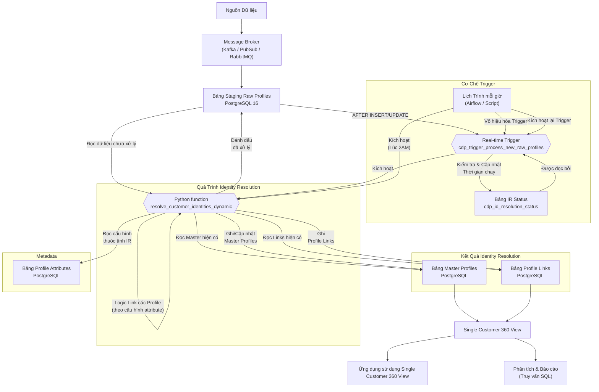

# Giải Pháp Nhận Dạng Danh Tính Khách Hàng (Customer Identity Resolution)

## Bắt đầu setup infrastructure

Tài liệu này mô tả giải pháp kỹ thuật để xây dựng hệ thống nhận dạng danh tính khách hàng (Customer Identity Resolution - CIR) nhằm hợp nhất dữ liệu khách hàng từ nhiều nguồn khác nhau thành một hồ sơ duy nhất. Giải pháp sử dụng các công cụ Message Broker nguồn mở cho ingestion dữ liệu và Managed PostgreSQL 16+ làm trung tâm xử lý và lưu trữ.

Các bước thiết lập hạ tầng ban đầu bao gồm:

1. **Thiết lập Database PostgreSQL 16+:**
* Tạo một instance PostgreSQL 16 (Sử dụng Cloud SQL trên GCP, RDS trên AWS, Flexible Server trên Azure, hoặc tự host).
* Chọn loại instance phù hợp với workload (ví dụ: các dòng Memory-Optimized có RAM lớn cho 5 triệu profile và xử lý nặng), cấu hình High Availability (HA) cho tính sẵn sàng cao.
* Chọn loại lưu trữ SSD tốc độ cao (ví dụ: gp3/Premium SSD) với dung lượng ban đầu đủ lớn (100-200GB) và có thể mở rộng tự động.
* Cấu hình Firewall/Security Groups để cho phép kết nối từ hệ thống Ingestion và các ứng dụng cần truy cập database.
* Tạo người dùng database với các quyền cần thiết.


2. **Thiết lập Hệ thống Ingestion Data:**
* Sử dụng Message Broker hoặc Data Stream (ví dụ: Apache Kafka, RabbitMQ, Google Pub/Sub, Azure Event Hubs).
* Cấu hình ứng dụng Worker (ví dụ: Kafka Connect, Logstash, hoặc script tự viết) để đọc dữ liệu từ luồng stream.
* Chỉ định đích đến là instance PostgreSQL 16 đã tạo (endpoint, port, tên DB, user/password - nên lưu trong các dịch vụ Secret Manager của Cloud).
* Cấu hình Worker đẩy dữ liệu vào bảng đích ban đầu (`cdp_raw_profiles_stage`).
* Cấu hình xử lý lỗi (Dead Letter Queue) và lưu trữ bản sao lưu vào Object Storage (S3/GCS/Blob Storage).


3. **Thiết lập Môi trường Lịch Trình Hàng Ngày:**
* Chuẩn bị môi trường để chạy script định kỳ (ví dụ: Cronjob trên VM, Apache Airflow, hoặc Serverless Functions như Cloud Functions/Lambda).
* Cài đặt thư viện cần thiết (ví dụ: `psycopg2` cho Python).
* Cấu hình quyền truy cập database cho môi trường này.


Độ chính xác của giải pháp phụ thuộc nhiều vào **chất lượng dữ liệu** đầu vào. Cần có các quy trình tiền xử lý và chuẩn hóa dữ liệu (ví dụ: làm sạch địa chỉ, chuẩn hóa số điện thoại) trước khi dữ liệu được đẩy vào Database.

## Các Thành phần Chính

Giải pháp bao gồm các thành phần chính sau:

* **Data Ingestion Layer (Kafka/PubSub/RabbitMQ):** Dịch vụ tiếp nhận luồng dữ liệu, đẩy dữ liệu thô vào bảng staging trong PostgreSQL.
* **PostgreSQL 16+:** Cơ sở dữ liệu trung tâm, lưu trữ dữ liệu, metadata và thực thi logic xử lý.
* **Bảng Staging (`cdp_raw_profiles_stage`):** Nơi dữ liệu thô được ghi vào.
* **Bảng Metadata (`cdp_profile_attributes`):** Định nghĩa cấu trúc và thuộc tính của các trường dữ liệu profile, bao gồm cả cấu hình cho nhận dạng danh tính (thuộc tính nào dùng để ghép nối, quy tắc ghép nối, cách tổng hợp dữ liệu).
* **Bảng Master Profiles (`cdp_master_profiles`):** Lưu trữ các hồ sơ khách hàng "vàng" đã được giải quyết.
* **Bảng Profile Links (`cdp_profile_links`):** Lưu trữ mối quan hệ liên kết giữa các bản ghi thô và hồ sơ master.
* ** Python code (`resolve_customer_identities_dynamic`):** Chứa toàn bộ logic nhận dạng danh tính, đọc cấu hình từ `cdp_profile_attributes` và xử lý dữ liệu trong bảng staging.
* **Extensions:** `citext`, `fuzzystrmatch`, `pg_trgm` hỗ trợ so sánh chuỗi và fuzzy matching.


* **Real-time Trigger (`cdp_trigger_process_new_raw_profiles`):** Một trigger trên bảng `cdp_raw_profiles_stage` để kích hoạt xử lý ngay khi có dữ liệu mới đến.
* **Trigger Function (`process_new_raw_profiles_trigger_func`):** Hàm được gọi bởi real-time trigger, có nhiệm vụ gọi stored procedure chính.
* **Lịch trình mỗi giờ  (External Scheduler):** Một quy trình bên ngoài hoặc tiện ích nội bộ được lên lịch chạy định kỳ để đảm bảo quét toàn bộ bảng staging và quản lý trạng thái của real-time trigger.

## Flow chính

Biểu đồ sau mô tả luồng dữ liệu và các thành phần trong giải pháp:



## Thiết lập Database Schema (SQL)

Phần này cung cấp các lệnh SQL để tạo cấu trúc cơ sở dữ liệu cần thiết.

### Extension

```sql
-- Cài đặt các Extension cần thiết cho Fuzzy Matching
CREATE EXTENSION IF NOT EXISTS citext; -- Cho so sánh không phân biệt chữ hoa chữ thường
CREATE EXTENSION IF NOT EXISTS fuzzystrmatch; -- Cho soundex, dmetaphone, levenshtein
CREATE EXTENSION IF NOT EXISTS pg_trgm; -- Cho similarity based on trigrams

```

### Tables for meta-data

Đây là một thiết kế **metadata-driven** cho hệ thống quản lý thuộc tính (attribute) của profile trong một Customer Data Platform (CDP).

Mục đích và lý do:

* Cho phép người dùng định nghĩa động các thuộc tính profile không cần thay đổi schema DB.
* Cho phép triển khai hệ thống **Identity Resolution** linh hoạt theo từng trường cụ thể.
* Hỗ trợ nhiều loại logic xử lý ETL như mapping, masking, phân nhóm, đồng bộ.

Bảng `cdp_profile_attributes` là trung tâm, chứa cấu hình cho từng thuộc tính có thể xuất hiện trong một profile (ví dụ: họ tên, email, độ tuổi, v.v.).
Phía dưới là phần **giải thích chi tiết từng bảng và cột**:

#### 🔹 1. `cdp_attribute_type`

**Mục đích**: Xác định loại của attribute theo hướng UI hoặc logic dữ liệu.

```sql
-- Bảng Metadata: attribute_type (Placeholder - cần định nghĩa chi tiết nếu sử dụng FK)
-- Bảng này định nghĩa các loại control UI hoặc kiểu attribute chung.
CREATE TABLE IF NOT EXISTS cdp_attribute_type (
    id SERIAL PRIMARY KEY,
    type_name VARCHAR(100) UNIQUE NOT NULL
);

```

**Ví dụ giá trị**:

* `text_field`, `dropdown`, `checkbox`, `multi-select`, `date_picker`,...

---

#### 🔹 2. `cdp_objects`

**Mục đích**: Xác định *loại đối tượng* mà thuộc tính này thuộc về (ví dụ: Customer, Product, Booking...).

```sql
-- Bảng Metadata: objects (Placeholder - cần định nghĩa chi tiết nếu sử dụng FK)
-- Bảng này định nghĩa các loại đối tượng chính (ví dụ: Customer, Product).
CREATE TABLE IF NOT EXISTS cdp_objects (
    id SERIAL PRIMARY KEY,
    object_name VARCHAR(100) UNIQUE NOT NULL
);

```

**Ví dụ giá trị**:

* `Customer`, `Lead`, `Product`, `Transaction`,...

---

#### 🔹 3. `cdp_profile_attributes`

**Mục đích**: Định nghĩa đầy đủ về một attribute bao gồm:

* Metadata mô tả logic lưu trữ & hiển thị
* Thông tin xử lý dữ liệu
* Luật cho identity resolution
* Tùy chọn hiển thị / UI / logic nghiệp vụ

```sql
-- Bảng Metadata: cdp_profile_attributes
-- Bảng này định nghĩa *meta-data* cho từng thuộc tính (attribute) của profile.
CREATE TABLE cdp_profile_attributes (
    id BIGSERIAL PRIMARY KEY,
    attribute_internal_code VARCHAR(100) UNIQUE NOT NULL,
    name VARCHAR(255) NOT NULL,
    status VARCHAR(50) DEFAULT 'ACTIVE', -- vd: 'ACTIVE', 'INACTIVE', 'DELETED'
    attribute_type_id INT NULL REFERENCES cdp_attribute_type(id), 
    data_type VARCHAR(50) NOT NULL, -- vd: 'VARCHAR', 'INT', 'BOOLEAN', 'DATETIME', 'JSONB', 'FLOAT'
    object_id INT NULL REFERENCES cdp_objects(id), 
    is_required BOOLEAN DEFAULT FALSE,
    
    is_index BOOLEAN DEFAULT FALSE, -- Có nên tạo index cho giá trị của attribute này không?
    is_masking BOOLEAN DEFAULT FALSE, -- Có cần che (masking) giá trị của attribute này khi hiển thị không?
    storage_type VARCHAR(50) NULL, -- Cách lưu trữ giá trị (vd: 'COLUMN', 'JSON_FIELD')
    attribute_size INT NULL, -- Kích thước dữ liệu (vd: max length cho VARCHAR)
    attribute_group VARCHAR(100) NULL, -- Nhóm logic trên UI
    parent_id BIGINT NULL REFERENCES cdp_profile_attributes(id), -- ID của attribute cha (cho cấu trúc lồng)
    option_value JSONB NULL, -- Lưu các tùy chọn dưới dạng JSONB cho tốc độ truy xuất tốt hơn
    process_status VARCHAR(50) NULL, -- Trạng thái liên quan đến quy trình xử lý dữ liệu
    attribute_status VARCHAR(50) NULL, -- Trạng thái cụ thể khác
    last_processed_on TIMESTAMP WITH TIME ZONE NULL, 
    created_at TIMESTAMP WITH TIME ZONE DEFAULT CURRENT_TIMESTAMP,
    created_by VARCHAR(100) NULL,
    update_at TIMESTAMP WITH TIME ZONE NULL, 
    update_by VARCHAR(100) NULL,

    -- Cột bổ sung cho cấu hình Identity Resolution
    is_identity_resolution BOOLEAN DEFAULT FALSE, -- CÓ dùng thuộc tính này để tìm và hợp nhất profile không?
    is_synchronizable BOOLEAN DEFAULT TRUE,
    data_quality_score INT NULL, 
    matching_rule VARCHAR(50) NULL, -- vd: 'exact', 'fuzzy_trgm', 'fuzzy_dmetaphone', 'none'
    matching_threshold DECIMAL(5, 4) NULL, -- Ngưỡng cho fuzzy match (vd: 0.8)
    consolidation_rule VARCHAR(50) NULL -- Cách tổng hợp giá trị (vd: 'most_recent', 'non_null')
);

```

### Trigger

```sql
-- Trigger để tự động cập nhật cột update_at
CREATE OR REPLACE FUNCTION update_profile_attributes_timestamp()
RETURNS TRIGGER AS $$
BEGIN
    NEW.update_at = NOW();
    RETURN NEW;
END;
$$ LANGUAGE plpgsql;

CREATE TRIGGER before_profile_attributes_update
BEFORE UPDATE ON cdp_profile_attributes
FOR EACH ROW
EXECUTE FUNCTION update_profile_attributes_timestamp();

```

### Table cdp_raw_profiles_stage

```sql
-- Bảng 1: cdp_raw_profiles_stage
-- Data Worker sẽ đẩy dữ liệu vào bảng này.
CREATE TABLE cdp_raw_profiles_stage (
    raw_profile_id UUID PRIMARY KEY DEFAULT gen_random_uuid(), -- PostgreSQL 13+ hỗ trợ native gen_random_uuid()
    first_name VARCHAR(255),
    last_name VARCHAR(255),
    email citext, -- Sử dụng citext cho email (không phân biệt hoa thường)
    phone_number VARCHAR(50),
    address_line1 VARCHAR(255),
    city VARCHAR(255),
    state VARCHAR(255),
    zip_code VARCHAR(10),
    source_system VARCHAR(100), -- Hệ thống nguồn của bản ghi
    received_at TIMESTAMP WITH TIME ZONE DEFAULT NOW(),
    processed_at TIMESTAMP WITH TIME ZONE -- Đánh dấu thời gian xử lý (NULL = chưa xử lý)
);

-- Tạo Index cho các trường quan trọng dùng cho ghép nối
CREATE INDEX idx_raw_profiles_stage_email ON cdp_raw_profiles_stage (email); 
CREATE INDEX idx_raw_profiles_stage_phone ON cdp_raw_profiles_stage (phone_number); 
CREATE INDEX idx_raw_profiles_stage_name_trgm ON cdp_raw_profiles_stage USING gin (first_name gin_trgm_ops, last_name gin_trgm_ops); 

```

### Table cdp_master_profiles

```sql
-- Bảng 2: cdp_master_profiles
-- Lưu trữ các hồ sơ khách hàng đã được giải quyết (unique identities)
CREATE TABLE cdp_master_profiles (
    master_profile_id UUID PRIMARY KEY DEFAULT gen_random_uuid(),
    first_name VARCHAR(255),
    last_name VARCHAR(255),
    email citext,
    phone_number VARCHAR(50),
    address_line1 VARCHAR(255),
    city VARCHAR(255),
    state VARCHAR(255),
    zip_code VARCHAR(10),
    created_at TIMESTAMP WITH TIME ZONE DEFAULT NOW(),
    updated_at TIMESTAMP WITH TIME ZONE DEFAULT NOW(),
    first_seen_raw_profile_id UUID, -- ID của bản ghi thô đầu tiên liên kết với master này
    source_systems TEXT[] -- Danh sách các hệ thống nguồn liên quan
);

-- Tạo Index tìm kiếm Master
CREATE INDEX idx_master_profiles_email ON cdp_master_profiles (email);
CREATE INDEX idx_master_profiles_phone ON cdp_master_profiles (phone_number);
CREATE INDEX idx_master_profiles_name_trgm ON cdp_master_profiles USING gin (first_name gin_trgm_ops, last_name gin_trgm_ops);

```

### Table cdp_profile_links

```sql
-- Bảng 3: cdp_profile_links
-- Liên kết các hồ sơ thô với hồ hồ sơ master tương ứng
CREATE TABLE cdp_profile_links (
    link_id BIGSERIAL PRIMARY KEY,
    raw_profile_id UUID NOT NULL REFERENCES cdp_raw_profiles_stage(raw_profile_id),
    master_profile_id UUID NOT NULL REFERENCES cdp_master_profiles(master_profile_id),
    linked_at TIMESTAMP WITH TIME ZONE DEFAULT NOW(),
    match_rule VARCHAR(100) -- Ghi lại quy tắc đã dẫn đến việc liên kết
);

-- Tạo Index tra cứu nhanh
CREATE INDEX idx_profile_links_raw_id ON cdp_profile_links (raw_profile_id);
CREATE INDEX idx_profile_links_master_id ON cdp_profile_links (master_profile_id);

-- Ràng buộc duy nhất để tránh 1 bản ghi thô link tới nhiều master
ALTER TABLE cdp_profile_links ADD CONSTRAINT uk_profile_links_raw_id UNIQUE (raw_profile_id);

```

## Cơ chế "Real-time" Trigger

Để xử lý dữ liệu mới đến theo thời gian thực, chúng ta tạo một trigger trên bảng `cdp_raw_profiles_stage`. Trigger này gọi hàm Python function chính (`resolve_customer_identities_dynamic`).

**Để tránh quá tải database khi stream dữ liệu với tần suất cao**, hàm trigger sẽ kiểm tra thời gian chạy gần nhất trong bảng trạng thái (`cdp_id_resolution_status`).

**1. Tạo bảng trạng thái:**

```sql
-- Bảng Metadata theo dõi trạng thái và thời gian chạy để tránh kích hoạt liên tục (Throttling)
CREATE TABLE cdp_id_resolution_status (
    id BOOLEAN PRIMARY KEY DEFAULT TRUE, 
    last_executed_at timestamp with time zone, 
    CONSTRAINT cdp_id_resolution_status_pkey PRIMARY KEY (id),
    CONSTRAINT enforce_one_row CHECK (id = TRUE) -- Đảm bảo chỉ có 1 row duy nhất
);

-- Chèn bản ghi ban đầu
INSERT INTO cdp_id_resolution_status (id, last_executed_at) VALUES (TRUE, NULL) ON CONFLICT (id) DO NOTHING;

```

**2. Tạo hoặc sửa đổi hàm trigger:**

```python 

import logging
import time
from datetime import datetime
import psycopg2
from psycopg2.extras import RealDictCursor

# Assuming the CustomerIdentityResolver class from the previous step is available
# from cdp_resolution import CustomerIdentityResolver

# Set up logging
logger = logging.getLogger(__name__)

class IdentityResolutionTrigger:
    """
    Replicates the PostgreSQL trigger 'cdp_trigger_process_new_raw_profiles' 
    and the throttle function 'process_new_raw_profiles_trigger_func'.
    
    This controller uses distributed row-level locking (FOR UPDATE NOWAIT) 
    to ensure that identity resolution is throttled across multiple concurrent 
    Python workers.
    """

    def __init__(self, db_connection, schema: str = "customer360", throttle_seconds: int = 5):
        """
        Args:
            db_connection: A psycopg2 connection object.
            schema: The database schema containing the CDP tables.
            throttle_seconds: Minimum time (in seconds) between resolution runs.
        """
        self.conn = db_connection
        self.schema = schema
        self.throttle_seconds = throttle_seconds

    def attempt_trigger(self) -> bool:
        """
        Checks the throttle status and executes the resolution logic if the 
        minimum interval has passed. 
        
        It catches exceptions to mimic the original SQL trigger's behavior 
        of not blocking the main ingestion flow.
        
        Returns:
            bool: True if the resolution logic was triggered, False if throttled or skipped.
        """
        executed = False
        
        try:
            with self.conn.cursor(cursor_factory=RealDictCursor) as cursor:
                # 1. Acquire a row-level lock to prevent race conditions
                # NOWAIT ensures that if another worker holds the lock, this process 
                # skips immediately instead of waiting, behaving like a fast throttle.
                lock_query = f"""
                    SELECT last_executed_at 
                    FROM {self.schema}.cdp_id_resolution_status 
                    WHERE id = TRUE 
                    FOR UPDATE NOWAIT;
                """
                
                try:
                    cursor.execute(lock_query)
                    status_row = cursor.fetchone()
                except psycopg2.errors.LockNotAvailable:
                    logger.debug("Lock not available: Another worker is currently processing the trigger.")
                    self.conn.rollback()
                    return False

                if not status_row:
                    logger.warning("Status row missing. Please initialize 'cdp_id_resolution_status'.")
                    self.conn.rollback()
                    return False

                last_exec_time = status_row['last_executed_at']
                
                # Use timezone-aware current time if the database returned a timezone-aware datetime
                tz_info = last_exec_time.tzinfo if last_exec_time else None
                current_time = datetime.now(tz_info)

                # 2. Check the time interval limit (Throttle logic)
                should_run = False
                if last_exec_time is None:
                    should_run = True
                else:
                    time_elapsed = (current_time - last_exec_time).total_seconds()
                    if time_elapsed >= self.throttle_seconds:
                        should_run = True

                # 3. Execute logic if condition is met
                if should_run:
                    logger.info("Throttle interval passed. Executing Customer Identity Resolution...")
                    
                    # Update the execution timestamp immediately
                    update_query = f"""
                        UPDATE {self.schema}.cdp_id_resolution_status 
                        SET last_executed_at = NOW() 
                        WHERE id = TRUE;
                    """
                    cursor.execute(update_query)
                    
                    # Initialize and run the main OOP resolver logic
                    resolver = CustomerIdentityResolver(
                        db_connection=self.conn, 
                        schema=self.schema
                    )
                    # Note: run_resolution_batch() should handle its own commits.
                    resolver.run_resolution_batch()
                    
                    executed = True
                else:
                    logger.debug(f"Throttled: Only {time_elapsed}s elapsed (limit {self.throttle_seconds}s).")
                    self.conn.rollback() # Release the lock

        except Exception as e:
            # Equivalent to the EXCEPTION WHEN OTHERS block in PL/pgSQL
            # Ensures we don't crash the data ingestion worker if resolution fails
            logger.warning(f"Error in python trigger controller: {e}")
            self.conn.rollback()
        
        return executed

# ==========================================
# Example Usage in a Data Ingestion Worker
# ==========================================
if __name__ == "__main__":
    # In a real setup, you would use a connection pool (e.g., psycopg2.pool)
    conn = psycopg2.connect("dbname=cdp user=postgres password=secret")
    
    # Instantiate the trigger controller
    trigger_controller = IdentityResolutionTrigger(
        db_connection=conn, 
        schema="customer360",
        throttle_seconds=5
    )
    
    # Simulating a Data Worker loop (like reading from Kafka or RabbitMQ)
    while True:
        # 1. Ingest raw profile here...
        # insert_raw_profile_to_db(...)
        
        # 2. Call the trigger method after inserting data.
        # It will only actually run the resolution if 5 seconds have passed.
        trigger_controller.attempt_trigger()
        
        # Sleep to simulate message stream delay
        time.sleep(1)

```

## Cơ chế Lịch Trình Hàng Ngày (Daily Trigger)

Quy trình bên ngoài (Python, Node.js, Airflow...) sẽ chạy hàng ngày để dọn dẹp các bản ghi chưa được xử lý. Để tránh xung đột, phải vô hiệu hóa trigger real-time trước khi chạy.

### Daily Trigger using Python code

```python
import psycopg2
import os
import time
from datetime import datetime

# Lấy cấu hình DB từ biến môi trường của hệ thống Cloud
DB_HOST = os.environ.get("DB_HOST", "your_db_endpoint")
DB_NAME = os.environ.get("DB_NAME", "your_database_name")
DB_USER = os.environ.get("DB_USER", "your_database_user")
DB_PASSWORD = os.environ.get("DB_PASSWORD", "your_database_password")
DB_PORT = os.environ.get("DB_PORT", "5432")

RAW_STAGE_TABLE = "cdp_raw_profiles_stage"
REALTIME_TRIGGER_NAME = "cdp_trigger_process_new_raw_profiles"
RESOLUTION_SP_NAME = "resolve_customer_identities_dynamic"

def run_daily_identity_resolution():
    conn = None
    try:
        conn = psycopg2.connect(
            host=DB_HOST, database=DB_NAME, user=DB_USER, password=DB_PASSWORD, port=DB_PORT
        )
        conn.autocommit = True 

        with conn.cursor() as cur:
            print(f"[{datetime.now()}] Bắt đầu quá trình lịch trình hàng ngày.")

            # 1. Vô hiệu hóa trigger real-time
            cur.execute(f"ALTER TABLE {RAW_STAGE_TABLE} DISABLE TRIGGER {REALTIME_TRIGGER_NAME};")
            time.sleep(5) 

            # 2. Gọi Stored Procedure chính
            cur.execute(f"SELECT {RESOLUTION_SP_NAME}();") 
            print(f"[{datetime.now()}] Stored procedure đã hoàn thành.")

            # 3. Kích hoạt lại trigger
            cur.execute(f"ALTER TABLE {RAW_STAGE_TABLE} ENABLE TRIGGER {REALTIME_TRIGGER_NAME};")
            print(f"[{datetime.now()}] Quá trình hoàn tất.")

    except Exception as e:
        print(f"[{datetime.now()}] Lỗi trong quá trình thực thi: {e}")
        if conn:
             try:
                 with conn.cursor() as cur:
                     cur.execute(f"ALTER TABLE {RAW_STAGE_TABLE} ENABLE TRIGGER {REALTIME_TRIGGER_NAME};")
             except Exception as rollback_e:
                 print(f"[{datetime.now()}] Lỗi khi bật lại trigger: {rollback_e}")
    finally:
        if conn:
            conn.close()

if __name__ == "__main__":
    run_daily_identity_resolution()

```

## OOP Python Implementation for Customer Identity Resolution

Đây là code  xử lý trung tâm, đọc rule từ MetaData và xây dựng câu lệnh SQL Dynamic.

```python

import logging
from dataclasses import dataclass
from typing import List, Optional, Dict, Any
import psycopg2
from psycopg2.extras import RealDictCursor

# Set up logging for pipeline observability
logger = logging.getLogger(__name__)

@dataclass
class IdentityRule:
    """Represents a matching rule from the metadata configuration."""
    attribute_code: str
    match_rule: str
    threshold: Optional[float] = None

class CustomerIdentityResolver:
    """
    Handles Customer Identity Resolution (CIR) by linking raw profiles to master profiles 
    using dynamically configured matching rules[cite: 1].
    """

    def __init__(self, db_connection, schema: str = "customer360", batch_size: int = 1000):
        """
        Initializes the resolver with an injected database connection for easy unit testing.
        
        Args:
            db_connection: A psycopg2 connection object (or a connection pool).
            schema: The database schema containing the CDP tables[cite: 2].
            batch_size: Number of records to process in memory per run[cite: 1].
        """
        self.conn = db_connection
        self.schema = schema
        self.batch_size = batch_size

    def _get_active_rules(self, cursor) -> List[IdentityRule]:
        """Fetches active identity resolution rules from the metadata table[cite: 1]."""
        query = f"""
            SELECT attribute_internal_code, matching_rule, matching_threshold
            FROM {self.schema}.cdp_profile_attributes
            WHERE is_identity_resolution = TRUE 
              AND status = 'ACTIVE'
              AND matching_rule IS NOT NULL 
              AND matching_rule != 'none';
        """
        cursor.execute(query)
        rules = []
        for row in cursor.fetchall():
            rules.append(IdentityRule(
                attribute_code=row['attribute_internal_code'],
                match_rule=row['matching_rule'],
                threshold=row['matching_threshold']
            ))
        return rules

    def _fetch_unprocessed_profiles(self, cursor) -> List[Dict[str, Any]]:
        """Fetches a batch of raw profiles that have not been processed yet (status_code = 1)[cite: 2]."""
        query = f"""
            SELECT raw_profile_id, tenant_id, source_system, full_name, email, phone_number
            FROM {self.schema}.cdp_raw_profiles_stage
            WHERE status_code = 1
            LIMIT %s;
        """
        cursor.execute(query, (self.batch_size,))
        return cursor.fetchall()

    def _find_master_profile(self, cursor, raw_profile: Dict[str, Any], rules: List[IdentityRule]) -> Optional[str]:
        """
        Dynamically builds and executes a query to find a matching master profile 
        based on active metadata rules[cite: 1].
        """
        conditions = []
        params = []

        for rule in rules:
            raw_value = raw_profile.get(rule.attribute_code)
            if not raw_value:
                continue

            col_name = rule.attribute_code
            
            # Construct parameterized conditions based on the match rule[cite: 1]
            if rule.match_rule == 'exact':
                conditions.append(f"{col_name} = %s")
                params.append(raw_value)
            elif rule.match_rule == 'fuzzy_trgm':
                conditions.append(f"similarity({col_name}, %s) >= %s")
                params.extend([raw_value, rule.threshold])
            elif rule.match_rule == 'fuzzy_dmetaphone':
                conditions.append(f"dmetaphone({col_name}) = dmetaphone(%s)")
                params.append(raw_value)

        if not conditions:
            return None

        where_clause = " OR ".join(f"({c})" for c in conditions)
        query = f"""
            SELECT master_profile_id 
            FROM {self.schema}.cdp_master_profiles 
            WHERE tenant_id = %s AND ({where_clause})
            LIMIT 1;
        """
        
        # Prepend tenant_id to params for the WHERE clause
        query_params = [raw_profile['tenant_id']] + params
        cursor.execute(query, tuple(query_params))
        result = cursor.fetchone()
        
        return result['master_profile_id'] if result else None

    def _link_and_update(self, cursor, raw_profile: Dict[str, Any], master_id: str):
        """Updates an existing master profile and creates a link to the raw profile[cite: 1, 2]."""
        # Create the relationship link[cite: 2]
        link_query = f"""
            INSERT INTO {self.schema}.cdp_profile_links 
            (tenant_id, raw_profile_id, master_profile_id, match_method)
            VALUES (%s, %s, %s, %s)
            ON CONFLICT (tenant_id, raw_profile_id) DO NOTHING;
        """
        cursor.execute(link_query, (
            raw_profile['tenant_id'], 
            raw_profile['raw_profile_id'], 
            master_id, 
            'DynamicMatch'
        ))

        # Coalesce data to preserve existing master profile data while filling gaps[cite: 1]
        update_query = f"""
            UPDATE {self.schema}.cdp_master_profiles
            SET 
                full_name = COALESCE(full_name, %s),
                email = COALESCE(email, %s),
                phone_number = COALESCE(phone_number, %s),
                updated_at = NOW()
            WHERE master_profile_id = %s;
        """
        cursor.execute(update_query, (
            raw_profile.get('full_name'),
            raw_profile.get('email'),
            raw_profile.get('phone_number'),
            master_id
        ))

    def _create_master_and_link(self, cursor, raw_profile: Dict[str, Any]):
        """Creates a brand new master profile when no matches are found[cite: 1, 2]."""
        insert_master_query = f"""
            INSERT INTO {self.schema}.cdp_master_profiles 
            (tenant_id, full_name, email, phone_number)
            VALUES (%s, %s, %s, %s)
            RETURNING master_profile_id;
        """
        cursor.execute(insert_master_query, (
            raw_profile['tenant_id'],
            raw_profile.get('full_name'),
            raw_profile.get('email'),
            raw_profile.get('phone_number')
        ))
        new_master_id = cursor.fetchone()['master_profile_id']

        link_query = f"""
            INSERT INTO {self.schema}.cdp_profile_links 
            (tenant_id, raw_profile_id, master_profile_id, match_method)
            VALUES (%s, %s, %s, %s);
        """
        cursor.execute(link_query, (
            raw_profile['tenant_id'],
            raw_profile['raw_profile_id'],
            new_master_id,
            'NewMaster'
        ))

    def _mark_as_processed(self, cursor, raw_profile_id: str):
        """Updates the status of the raw profile to processed (status_code = 3)[cite: 2]."""
        query = f"""
            UPDATE {self.schema}.cdp_raw_profiles_stage
            SET status_code = 3 
            WHERE raw_profile_id = %s;
        """
        cursor.execute(query, (raw_profile_id,))

    def run_resolution_batch(self):
        """
        Main orchestration method for a single batch run. 
        Designed to be idempotent and safe for workflow retries.
        """
        try:
            with self.conn.cursor(cursor_factory=RealDictCursor) as cursor:
                rules = self._get_active_rules(cursor)
                if not rules:
                    logger.warning("No active identity resolution rules found. Aborting.")
                    return

                raw_profiles = self._fetch_unprocessed_profiles(cursor)
                if not raw_profiles:
                    logger.info("No unprocessed profiles found in staging.")
                    return

                logger.info(f"Processing batch of {len(raw_profiles)} profiles.")

                for profile in raw_profiles:
                    matched_id = self._find_master_profile(cursor, profile, rules)
                    
                    if matched_id:
                        self._link_and_update(cursor, profile, matched_id)
                    else:
                        self._create_master_and_link(cursor, profile)
                        
                    self._mark_as_processed(cursor, profile['raw_profile_id'])

                # Commit the entire batch transaction
                self.conn.commit()
                logger.info("Batch processed and committed successfully.")

        except Exception as e:
            self.conn.rollback()
            logger.error(f"Error during identity resolution: {e}")
            raise


```

## Integration with Data Pipeline Frameworks

### Apache Airflow 3 Example

```python
from airflow.decorators import dag, task
from airflow.providers.postgres.hooks.postgres import PostgresHook
from pendulum import datetime

@dag(schedule="@hourly", start_date=datetime(2026, 1, 1), catchup=False)
def cdp_identity_resolution_pipeline():

    @task()
    def resolve_identities():
        # Utilize Airflow's connection management
        pg_hook = PostgresHook(postgres_conn_id="cdp_postgres_db")
        conn = pg_hook.get_conn()
        
        try:
            # Instantiate the OOP resolver
            resolver = CustomerIdentityResolver(
                db_connection=conn, 
                schema="customer360", 
                batch_size=5000 # Configured for memory optimization[cite: 1]
            )
            resolver.run_resolution_batch()
        finally:
            conn.close()

    resolve_identities()

cdp_identity_resolution_pipeline()

```

### Dagster Example

```python
from dagster import asset, ConfigurableResource
import psycopg2

class PostgresResource(ConfigurableResource):
    conn_uri: str

    def get_connection(self):
        return psycopg2.connect(self.conn_uri)

@asset(compute_kind="python", group_name="cdp_core")
def resolve_customer_identities(pg_db: PostgresResource):
    """Runs the identity resolution process on staged raw profiles."""
    conn = pg_db.get_connection()
    
    try:
        resolver = CustomerIdentityResolver(
            db_connection=conn, 
            batch_size=2000
        )
        resolver.run_resolution_batch()
    finally:
        conn.close()

```

## UNIT TESTS

```sql
-- Xóa data cũ
DELETE FROM cdp_profile_attributes;

-- Khởi tạo metadata mẫu
INSERT INTO cdp_profile_attributes (
    id, name,  attribute_internal_code, data_type,
    is_identity_resolution, matching_rule, matching_threshold,
    consolidation_rule, status
) VALUES
(1, 'email', 'email', 'TEXT', TRUE, 'exact', NULL, 'non_null', 'ACTIVE'),
(2, 'phone_number','phone_number', 'TEXT', TRUE, 'exact', NULL, 'non_null', 'ACTIVE'),
(3,'first_name',  'first_name', 'TEXT', TRUE, 'fuzzy_dmetaphone', NULL, 'most_recent', 'ACTIVE'),
(4,'last_name', 'last_name', 'TEXT', TRUE, 'fuzzy_trgm', 0.7, 'most_recent', 'ACTIVE');


-- Reset bản ghi
DELETE FROM cdp_profile_links;
DELETE FROM cdp_raw_profiles_stage;
DELETE FROM cdp_master_profiles;

-- Thêm Profiles giả lập
INSERT INTO cdp_raw_profiles_stage (
    raw_profile_id, first_name, last_name, email, phone_number,
    address_line1, city, state, zip_code, source_system, processed_at
) VALUES
(gen_random_uuid(), 'John', 'Smith', 'john@example.com', '1234567890', '123 Elm St', 'New York', 'NY', '10001', 'SystemA', NULL),
(gen_random_uuid(), 'Jon', 'Smyth', 'john@example.com', NULL, '123 Elm Street', 'New York', 'NY', '10001', 'SystemB', NULL),
(gen_random_uuid(), 'Jane', 'Doe', 'jane.d@example.com', '5551234567', '456 Oak Ave', 'Los Angeles', 'CA', '90001', 'SystemA', NULL);

```

## Phân tích & Báo cáo (SQL)

```sql
-- Tổng Hồ sơ Thô (Total Raw Profiles)
SELECT COUNT(*) FROM cdp_raw_profiles_stage;

-- Hồ sơ Master Duy nhất (Unique Identities)
SELECT COUNT(*) FROM cdp_master_profiles;

-- Tổng Hồ sơ Thô đã xử lý
SELECT COUNT(*) FROM cdp_raw_profiles_stage WHERE processed_at IS NOT NULL;

-- Hồ sơ được xem là trùng lặp (Duplicate Records)
SELECT COUNT(*)
FROM cdp_profile_links pl
JOIN cdp_master_profiles mp ON pl.master_profile_id = mp.master_profile_id
WHERE pl.raw_profile_id != mp.first_seen_raw_profile_id; 

-- Hoặc đếm theo Master ID
SELECT COUNT(*) FROM (
    SELECT master_profile_id FROM cdp_profile_links GROUP BY master_profile_id HAVING COUNT(*) > 1
) AS duplicate_masters;

```

## Ghi chú khi triển khai thực tế và khả năng scale cho 5 triệu profiles

Triển khai giải pháp CIR (Customer Identity Resolution) cho 5 triệu profiles đòi hỏi sự cân nhắc kỹ lưỡng về **hiệu suất**, **tối ưu chi phí**, và **khả năng mở rộng**.

### 1. Tối Ưu Hóa Database

#### 🔍 Indexing

* Đảm bảo **tất cả thuộc tính có `is_identity_resolution = TRUE**` đều có index phù hợp.
* Sử dụng:
* `B-tree` cho truy vấn chính xác (exact match).
* `GIN + pg_trgm` cho khớp mờ (fuzzy matching).


* Thường xuyên `REINDEX` để tránh bloat.

#### ⚙️ Tham số PostgreSQL

Tối ưu cấu hình Server (dù là Managed hay Self-hosted):

* `shared_buffers`: ~25–40% RAM.
* `work_mem`: quan trọng để SORT/JOIN trong quá trình merge data.
* `maintenance_work_mem`: cần nhiều dung lượng để chạy index GIN mượt mà.

#### 🖥️ Loại Instance & Lưu trữ

* Yêu cầu **Memory-Optimized instances** (ví dụ: Cloud SQL HighMem / Azure Memory Optimized).
* Ổ cứng: Premium SSD (AWS gp3, Azure Premium, GCP pd-ssd) được Provision IOPS nếu tần suất luồng stream cao.

#### 🧩 Phân vùng (Partitioning)

* Cần áp dụng Partitioning (phân vùng Native của PostgreSQL) theo ngày `received_date` cho bảng `cdp_raw_profiles_stage` để dễ xoá xoay vòng dữ liệu cũ.

### 2. Tối Ưu Hóa Stored Procedure

#### 📦 Xử lý theo lô (Batching)

* Việc dùng `LIMIT batch_size` trong SP là bắt buộc. Cần tune số lượng tuỳ sức mạnh RAM hiện tại (Ví dụ 1000 - 5000 records/batch).

#### 🧬 Tổng hợp & Hợp nhất

* Ưu tiên cấu trúc `UPDATE` trên record gốc thay vì Delete/Insert. Lệnh `COALESCE` hiện tại đang tối ưu cho việc chèn thêm dữ liệu nếu record bị rỗng.

### 3. Cơ chế Kích hoạt

#### ⏱️ Trigger Real-time

* **Lưu ý cực kỳ quan trọng:** Nếu data đổ về vài nghìn records/giây (High Throughput), việc gọi Stored Procedure trực tiếp từ Trigger sẽ lock bảng DB. Trong production thật, hãy TẮT real-time trigger và chuyển sang chạy `pg_cron` tần suất mỗi 1-2 phút một lần để xử lý an toàn hơn.

### 4. Khả năng Scale

* Hệ thống chịu được tải 5M Profiles với 1 Node Master cấu hình lớn. Nếu tiếp tục tăng (VD: 20-50M), bạn sẽ phải chuyển đổi logic Master Table sang mô hình **Sharding (Citus Data)**, hoặc xuất hẳn dữ liệu sang các nền tảng Data Warehouse (BigQuery, Snowflake).

## ✅ CIR Implementation Checklist (5M Profiles)

### 🔧 **1. Database Setup & Config**

* [ ] Khởi tạo Managed PostgreSQL (Version 16+ để tận hưởng tối ưu index JSON/B-Tree).
* [ ] Ổ cứng SSD High-IOPS (Provisioned từ 8000+ IOPS).
* [ ] Tuning `shared_buffers`, `work_mem`, `max_connections`.

### 🧩 **2. Thiết kế bảng & phân vùng**

* [ ] Bảng thô có index `GIN` + `B-Tree` đầy đủ.
* [ ] Kích hoạt Time-based Partitioning.

### ⚙️ **3. Stored Procedure & Script**

* [ ] Test thử `batch_size` trên môi trường Staging. Đảm bảo 1 lô chạy < 1 giây.
* [ ] Tắt Real-time trigger nếu lượng Data Stream vượt 500 event/giây (Dùng Scheduler thay thế).

### 📊 **4. Monitoring & Observability**

* [ ] Bật Database Insights (Cloud SQL Insights, RDS Performance Insights).
* [ ] Cài cảnh báo (Alert) nếu `Deadlocks` > 0 hoặc Query Duration > 5 giây.
* [ ] Monitor số lượng record pending (`processed_at IS NULL`).

### 📦 **5. DevOps & CI/CD**

* [ ] Chạy backup Database tự động hàng ngày (Point-in-time recovery).
* [ ] Lưu các file SQL vào kho lưu trữ (Git) và Deploy qua công cụ Migrations.
