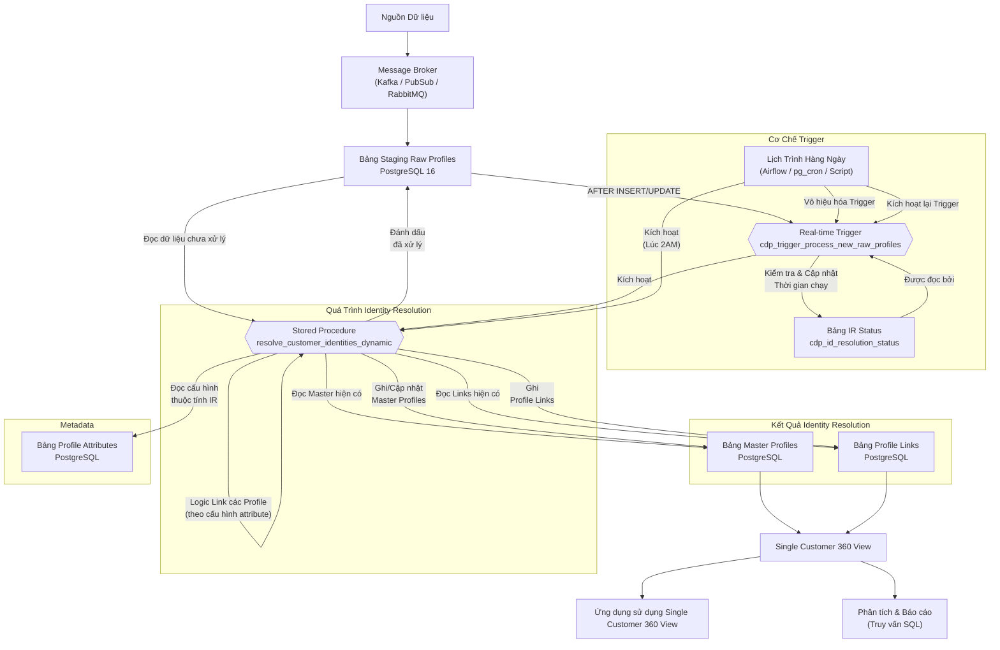

# Giải Pháp Nhận Dạng Danh Tính Khách Hàng (Customer Identity Resolution)

## Bắt đầu setup infrastructure

Tài liệu này mô tả giải pháp kỹ thuật để xây dựng hệ thống nhận dạng danh tính khách hàng (Customer Identity Resolution - CIR) nhằm hợp nhất dữ liệu khách hàng từ nhiều nguồn khác nhau thành một hồ sơ duy nhất. Giải pháp sử dụng các công cụ Message Broker nguồn mở cho ingestion dữ liệu và Managed PostgreSQL 16+ làm trung tâm xử lý và lưu trữ.

Các bước thiết lập hạ tầng ban đầu bao gồm:

1. **Thiết lập Database PostgreSQL 16+:**
* Tạo một instance PostgreSQL 16 (Sử dụng Cloud SQL trên GCP, RDS trên AWS, Flexible Server trên Azure, hoặc tự host).
* Chọn loại instance phù hợp với workload (ví dụ: các dòng Memory-Optimized có RAM lớn cho 5 triệu profile và xử lý nặng), cấu hình High Availability (HA) cho tính sẵn sàng cao.
* Chọn loại lưu trữ SSD tốc độ cao (ví dụ: gp3/Premium SSD) với dung lượng ban đầu đủ lớn (100-200GB) và có thể mở rộng tự động.
* Cấu hình Firewall/Security Groups để cho phép kết nối từ hệ thống Ingestion và các ứng dụng cần truy cập database.
* Tạo người dùng database với các quyền cần thiết.


2. **Thiết lập Hệ thống Ingestion Data:**
* Sử dụng Message Broker hoặc Data Stream (ví dụ: Apache Kafka, RabbitMQ, Google Pub/Sub, Azure Event Hubs).
* Cấu hình ứng dụng Worker (ví dụ: Kafka Connect, Logstash, hoặc script tự viết) để đọc dữ liệu từ luồng stream.
* Chỉ định đích đến là instance PostgreSQL 16 đã tạo (endpoint, port, tên DB, user/password - nên lưu trong các dịch vụ Secret Manager của Cloud).
* Cấu hình Worker đẩy dữ liệu vào bảng đích ban đầu (`cdp_raw_profiles_stage`).
* Cấu hình xử lý lỗi (Dead Letter Queue) và lưu trữ bản sao lưu vào Object Storage (S3/GCS/Blob Storage).


3. **Thiết lập Môi trường Lịch Trình Hàng Ngày:**
* Chuẩn bị môi trường để chạy script định kỳ (ví dụ: Cronjob trên VM, Apache Airflow, hoặc Serverless Functions như Cloud Functions/Lambda).
* Cài đặt thư viện cần thiết (ví dụ: `psycopg2` cho Python).
* Cấu hình quyền truy cập database cho môi trường này.


Độ chính xác của giải pháp phụ thuộc nhiều vào **chất lượng dữ liệu** đầu vào. Cần có các quy trình tiền xử lý và chuẩn hóa dữ liệu (ví dụ: làm sạch địa chỉ, chuẩn hóa số điện thoại) trước khi dữ liệu được đẩy vào Database.

## Các Thành phần Chính

Giải pháp bao gồm các thành phần chính sau:

* **Data Ingestion Layer (Kafka/PubSub/RabbitMQ):** Dịch vụ tiếp nhận luồng dữ liệu, đẩy dữ liệu thô vào bảng staging trong PostgreSQL.
* **PostgreSQL 16+:** Cơ sở dữ liệu trung tâm, lưu trữ dữ liệu, metadata và thực thi logic xử lý.
* **Bảng Staging (`cdp_raw_profiles_stage`):** Nơi dữ liệu thô được ghi vào.
* **Bảng Metadata (`cdp_profile_attributes`):** Định nghĩa cấu trúc và thuộc tính của các trường dữ liệu profile, bao gồm cả cấu hình cho nhận dạng danh tính (thuộc tính nào dùng để ghép nối, quy tắc ghép nối, cách tổng hợp dữ liệu).
* **Bảng Master Profiles (`cdp_master_profiles`):** Lưu trữ các hồ sơ khách hàng "vàng" đã được giải quyết.
* **Bảng Profile Links (`cdp_profile_links`):** Lưu trữ mối quan hệ liên kết giữa các bản ghi thô và hồ sơ master.
* **Stored Procedure (`resolve_customer_identities_dynamic`):** Chứa toàn bộ logic nhận dạng danh tính, đọc cấu hình từ `cdp_profile_attributes` và xử lý dữ liệu trong bảng staging.
* **Extensions:** `citext`, `fuzzystrmatch`, `pg_trgm` hỗ trợ so sánh chuỗi và fuzzy matching.


* **Real-time Trigger (`cdp_trigger_process_new_raw_profiles`):** Một trigger trên bảng `cdp_raw_profiles_stage` để kích hoạt xử lý ngay khi có dữ liệu mới đến.
* **Trigger Function (`process_new_raw_profiles_trigger_func`):** Hàm được gọi bởi real-time trigger, có nhiệm vụ gọi stored procedure chính.
* **Lịch Trình Hàng Ngày (External Scheduler / pg_cron):** Một quy trình bên ngoài hoặc tiện ích nội bộ được lên lịch chạy định kỳ để đảm bảo quét toàn bộ bảng staging và quản lý trạng thái của real-time trigger.

## Flow chính

Biểu đồ sau mô tả luồng dữ liệu và các thành phần trong giải pháp:



## Thiết lập Database Schema (SQL)

Phần này cung cấp các lệnh SQL để tạo cấu trúc cơ sở dữ liệu cần thiết.

### Extension

```sql
-- Cài đặt các Extension cần thiết cho Fuzzy Matching
CREATE EXTENSION IF NOT EXISTS citext; -- Cho so sánh không phân biệt chữ hoa chữ thường
CREATE EXTENSION IF NOT EXISTS fuzzystrmatch; -- Cho soundex, dmetaphone, levenshtein
CREATE EXTENSION IF NOT EXISTS pg_trgm; -- Cho similarity based on trigrams

```

### Tables for meta-data

Đây là một thiết kế **metadata-driven** cho hệ thống quản lý thuộc tính (attribute) của profile trong một Customer Data Platform (CDP).

Mục đích và lý do:

* Cho phép người dùng định nghĩa động các thuộc tính profile không cần thay đổi schema DB.
* Cho phép triển khai hệ thống **Identity Resolution** linh hoạt theo từng trường cụ thể.
* Hỗ trợ nhiều loại logic xử lý ETL như mapping, masking, phân nhóm, đồng bộ.

Bảng `cdp_profile_attributes` là trung tâm, chứa cấu hình cho từng thuộc tính có thể xuất hiện trong một profile (ví dụ: họ tên, email, độ tuổi, v.v.).
Phía dưới là phần **giải thích chi tiết từng bảng và cột**:

#### 🔹 1. `cdp_attribute_type`

**Mục đích**: Xác định loại của attribute theo hướng UI hoặc logic dữ liệu.

```sql
-- Bảng Metadata: attribute_type (Placeholder - cần định nghĩa chi tiết nếu sử dụng FK)
-- Bảng này định nghĩa các loại control UI hoặc kiểu attribute chung.
CREATE TABLE IF NOT EXISTS cdp_attribute_type (
    id SERIAL PRIMARY KEY,
    type_name VARCHAR(100) UNIQUE NOT NULL
);

```

**Ví dụ giá trị**:

* `text_field`, `dropdown`, `checkbox`, `multi-select`, `date_picker`,...

---

#### 🔹 2. `cdp_objects`

**Mục đích**: Xác định *loại đối tượng* mà thuộc tính này thuộc về (ví dụ: Customer, Product, Booking...).

```sql
-- Bảng Metadata: objects (Placeholder - cần định nghĩa chi tiết nếu sử dụng FK)
-- Bảng này định nghĩa các loại đối tượng chính (ví dụ: Customer, Product).
CREATE TABLE IF NOT EXISTS cdp_objects (
    id SERIAL PRIMARY KEY,
    object_name VARCHAR(100) UNIQUE NOT NULL
);

```

**Ví dụ giá trị**:

* `Customer`, `Lead`, `Product`, `Transaction`,...

---

#### 🔹 3. `cdp_profile_attributes`

**Mục đích**: Định nghĩa đầy đủ về một attribute bao gồm:

* Metadata mô tả logic lưu trữ & hiển thị
* Thông tin xử lý dữ liệu
* Luật cho identity resolution
* Tùy chọn hiển thị / UI / logic nghiệp vụ

```sql
-- Bảng Metadata: cdp_profile_attributes
-- Bảng này định nghĩa *meta-data* cho từng thuộc tính (attribute) của profile.
CREATE TABLE cdp_profile_attributes (
    id BIGSERIAL PRIMARY KEY,
    attribute_internal_code VARCHAR(100) UNIQUE NOT NULL,
    name VARCHAR(255) NOT NULL,
    status VARCHAR(50) DEFAULT 'ACTIVE', -- vd: 'ACTIVE', 'INACTIVE', 'DELETED'
    attribute_type_id INT NULL REFERENCES cdp_attribute_type(id), 
    data_type VARCHAR(50) NOT NULL, -- vd: 'VARCHAR', 'INT', 'BOOLEAN', 'DATETIME', 'JSONB', 'FLOAT'
    object_id INT NULL REFERENCES cdp_objects(id), 
    is_required BOOLEAN DEFAULT FALSE,
    
    is_index BOOLEAN DEFAULT FALSE, -- Có nên tạo index cho giá trị của attribute này không?
    is_masking BOOLEAN DEFAULT FALSE, -- Có cần che (masking) giá trị của attribute này khi hiển thị không?
    storage_type VARCHAR(50) NULL, -- Cách lưu trữ giá trị (vd: 'COLUMN', 'JSON_FIELD')
    attribute_size INT NULL, -- Kích thước dữ liệu (vd: max length cho VARCHAR)
    attribute_group VARCHAR(100) NULL, -- Nhóm logic trên UI
    parent_id BIGINT NULL REFERENCES cdp_profile_attributes(id), -- ID của attribute cha (cho cấu trúc lồng)
    option_value JSONB NULL, -- Lưu các tùy chọn dưới dạng JSONB cho tốc độ truy xuất tốt hơn
    process_status VARCHAR(50) NULL, -- Trạng thái liên quan đến quy trình xử lý dữ liệu
    attribute_status VARCHAR(50) NULL, -- Trạng thái cụ thể khác
    last_processed_on TIMESTAMP WITH TIME ZONE NULL, 
    created_at TIMESTAMP WITH TIME ZONE DEFAULT CURRENT_TIMESTAMP,
    created_by VARCHAR(100) NULL,
    update_at TIMESTAMP WITH TIME ZONE NULL, 
    update_by VARCHAR(100) NULL,

    -- Cột bổ sung cho cấu hình Identity Resolution
    is_identity_resolution BOOLEAN DEFAULT FALSE, -- CÓ dùng thuộc tính này để tìm và hợp nhất profile không?
    is_synchronizable BOOLEAN DEFAULT TRUE,
    data_quality_score INT NULL, 
    matching_rule VARCHAR(50) NULL, -- vd: 'exact', 'fuzzy_trgm', 'fuzzy_dmetaphone', 'none'
    matching_threshold DECIMAL(5, 4) NULL, -- Ngưỡng cho fuzzy match (vd: 0.8)
    consolidation_rule VARCHAR(50) NULL -- Cách tổng hợp giá trị (vd: 'most_recent', 'non_null')
);

```

### Trigger

```sql
-- Trigger để tự động cập nhật cột update_at
CREATE OR REPLACE FUNCTION update_profile_attributes_timestamp()
RETURNS TRIGGER AS $$
BEGIN
    NEW.update_at = NOW();
    RETURN NEW;
END;
$$ LANGUAGE plpgsql;

CREATE TRIGGER before_profile_attributes_update
BEFORE UPDATE ON cdp_profile_attributes
FOR EACH ROW
EXECUTE FUNCTION update_profile_attributes_timestamp();

```

### Table cdp_raw_profiles_stage

```sql
-- Bảng 1: cdp_raw_profiles_stage
-- Data Worker sẽ đẩy dữ liệu vào bảng này.
CREATE TABLE cdp_raw_profiles_stage (
    raw_profile_id UUID PRIMARY KEY DEFAULT gen_random_uuid(), -- PostgreSQL 13+ hỗ trợ native gen_random_uuid()
    first_name VARCHAR(255),
    last_name VARCHAR(255),
    email citext, -- Sử dụng citext cho email (không phân biệt hoa thường)
    phone_number VARCHAR(50),
    address_line1 VARCHAR(255),
    city VARCHAR(255),
    state VARCHAR(255),
    zip_code VARCHAR(10),
    source_system VARCHAR(100), -- Hệ thống nguồn của bản ghi
    received_at TIMESTAMP WITH TIME ZONE DEFAULT NOW(),
    processed_at TIMESTAMP WITH TIME ZONE -- Đánh dấu thời gian xử lý (NULL = chưa xử lý)
);

-- Tạo Index cho các trường quan trọng dùng cho ghép nối
CREATE INDEX idx_raw_profiles_stage_email ON cdp_raw_profiles_stage (email); 
CREATE INDEX idx_raw_profiles_stage_phone ON cdp_raw_profiles_stage (phone_number); 
CREATE INDEX idx_raw_profiles_stage_name_trgm ON cdp_raw_profiles_stage USING gin (first_name gin_trgm_ops, last_name gin_trgm_ops); 

```

### Table cdp_master_profiles

```sql
-- Bảng 2: cdp_master_profiles
-- Lưu trữ các hồ sơ khách hàng đã được giải quyết (unique identities)
CREATE TABLE cdp_master_profiles (
    master_profile_id UUID PRIMARY KEY DEFAULT gen_random_uuid(),
    first_name VARCHAR(255),
    last_name VARCHAR(255),
    email citext,
    phone_number VARCHAR(50),
    address_line1 VARCHAR(255),
    city VARCHAR(255),
    state VARCHAR(255),
    zip_code VARCHAR(10),
    created_at TIMESTAMP WITH TIME ZONE DEFAULT NOW(),
    updated_at TIMESTAMP WITH TIME ZONE DEFAULT NOW(),
    first_seen_raw_profile_id UUID, -- ID của bản ghi thô đầu tiên liên kết với master này
    source_systems TEXT[] -- Danh sách các hệ thống nguồn liên quan
);

-- Tạo Index tìm kiếm Master
CREATE INDEX idx_master_profiles_email ON cdp_master_profiles (email);
CREATE INDEX idx_master_profiles_phone ON cdp_master_profiles (phone_number);
CREATE INDEX idx_master_profiles_name_trgm ON cdp_master_profiles USING gin (first_name gin_trgm_ops, last_name gin_trgm_ops);

```

### Table cdp_profile_links

```sql
-- Bảng 3: cdp_profile_links
-- Liên kết các hồ sơ thô với hồ hồ sơ master tương ứng
CREATE TABLE cdp_profile_links (
    link_id BIGSERIAL PRIMARY KEY,
    raw_profile_id UUID NOT NULL REFERENCES cdp_raw_profiles_stage(raw_profile_id),
    master_profile_id UUID NOT NULL REFERENCES cdp_master_profiles(master_profile_id),
    linked_at TIMESTAMP WITH TIME ZONE DEFAULT NOW(),
    match_rule VARCHAR(100) -- Ghi lại quy tắc đã dẫn đến việc liên kết
);

-- Tạo Index tra cứu nhanh
CREATE INDEX idx_profile_links_raw_id ON cdp_profile_links (raw_profile_id);
CREATE INDEX idx_profile_links_master_id ON cdp_profile_links (master_profile_id);

-- Ràng buộc duy nhất để tránh 1 bản ghi thô link tới nhiều master
ALTER TABLE cdp_profile_links ADD CONSTRAINT uk_profile_links_raw_id UNIQUE (raw_profile_id);

```

## Cơ chế "Real-time" Trigger

Để xử lý dữ liệu mới đến theo thời gian thực, chúng ta tạo một trigger trên bảng `cdp_raw_profiles_stage`. Trigger này gọi hàm stored procedure chính (`resolve_customer_identities_dynamic`).

**Để tránh quá tải database khi stream dữ liệu với tần suất cao**, hàm trigger sẽ kiểm tra thời gian chạy gần nhất trong bảng trạng thái (`cdp_id_resolution_status`).

**1. Tạo bảng trạng thái:**

```sql
-- Bảng Metadata theo dõi trạng thái và thời gian chạy để tránh kích hoạt liên tục (Throttling)
CREATE TABLE cdp_id_resolution_status (
    id BOOLEAN PRIMARY KEY DEFAULT TRUE, 
    last_executed_at timestamp with time zone, 
    CONSTRAINT cdp_id_resolution_status_pkey PRIMARY KEY (id),
    CONSTRAINT enforce_one_row CHECK (id = TRUE) -- Đảm bảo chỉ có 1 row duy nhất
);

-- Chèn bản ghi ban đầu
INSERT INTO cdp_id_resolution_status (id, last_executed_at) VALUES (TRUE, NULL) ON CONFLICT (id) DO NOTHING;

```

**2. Tạo hoặc sửa đổi hàm trigger:**

```sql
-- Hàm kiểm tra tần suất và chỉ gọi SP chính nếu đủ điều kiện (Throttle)
CREATE OR REPLACE FUNCTION process_new_raw_profiles_trigger_func()
RETURNS TRIGGER AS $$
DECLARE
    min_interval INTERVAL := '5 seconds'; -- Giới hạn chạy tối đa 5 giây 1 lần
    last_exec_time TIMESTAMP WITH TIME ZONE;
    current_time TIMESTAMP WITH TIME ZONE := NOW();
BEGIN
    BEGIN
        -- Khóa bản ghi trạng thái để tránh đụng độ (Race condition)
        PERFORM 1 FROM cdp_id_resolution_status WHERE id = TRUE FOR UPDATE;
        SELECT last_executed_at INTO last_exec_time FROM cdp_id_resolution_status WHERE id = TRUE;

        -- Kiểm tra khoảng thời gian
        IF last_exec_time IS NULL OR current_time - last_exec_time >= min_interval THEN
            UPDATE cdp_id_resolution_status SET last_executed_at = current_time WHERE id = TRUE;
            
            -- Thực thi tiến trình ghép nối
            PERFORM resolve_customer_identities_dynamic();
        END IF;

    EXCEPTION
        WHEN OTHERS THEN
            RAISE WARNING 'Lỗi trong hàm trigger process_new_raw_profiles_trigger_func: %', SQLERRM;
            -- Bỏ qua lỗi trigger để không block tiến trình INSERT của Data Worker
            RETURN NULL; 
    END;

    RETURN NULL; 
END;
$$ LANGUAGE plpgsql;

```

**3. Tạo trigger:**

```sql
-- FOR EACH STATEMENT: Chạy 1 lần cho mỗi lô INSERT/UPDATE thay vì chạy cho từng dòng
CREATE TRIGGER cdp_trigger_process_new_raw_profiles
AFTER INSERT OR UPDATE ON cdp_raw_profiles_stage
FOR EACH STATEMENT
EXECUTE FUNCTION process_new_raw_profiles_trigger_func();

```

## Cơ chế Lịch Trình Hàng Ngày (Daily Trigger)

Quy trình bên ngoài (Python, Node.js, Airflow...) sẽ chạy hàng ngày để dọn dẹp các bản ghi chưa được xử lý. Để tránh xung đột, phải vô hiệu hóa trigger real-time trước khi chạy.

### Daily Trigger using Python code

```python
import psycopg2
import os
import time
from datetime import datetime

# Lấy cấu hình DB từ biến môi trường của hệ thống Cloud
DB_HOST = os.environ.get("DB_HOST", "your_db_endpoint")
DB_NAME = os.environ.get("DB_NAME", "your_database_name")
DB_USER = os.environ.get("DB_USER", "your_database_user")
DB_PASSWORD = os.environ.get("DB_PASSWORD", "your_database_password")
DB_PORT = os.environ.get("DB_PORT", "5432")

RAW_STAGE_TABLE = "cdp_raw_profiles_stage"
REALTIME_TRIGGER_NAME = "cdp_trigger_process_new_raw_profiles"
RESOLUTION_SP_NAME = "resolve_customer_identities_dynamic"

def run_daily_identity_resolution():
    conn = None
    try:
        conn = psycopg2.connect(
            host=DB_HOST, database=DB_NAME, user=DB_USER, password=DB_PASSWORD, port=DB_PORT
        )
        conn.autocommit = True 

        with conn.cursor() as cur:
            print(f"[{datetime.now()}] Bắt đầu quá trình lịch trình hàng ngày.")

            # 1. Vô hiệu hóa trigger real-time
            cur.execute(f"ALTER TABLE {RAW_STAGE_TABLE} DISABLE TRIGGER {REALTIME_TRIGGER_NAME};")
            time.sleep(5) 

            # 2. Gọi Stored Procedure chính
            cur.execute(f"SELECT {RESOLUTION_SP_NAME}();") 
            print(f"[{datetime.now()}] Stored procedure đã hoàn thành.")

            # 3. Kích hoạt lại trigger
            cur.execute(f"ALTER TABLE {RAW_STAGE_TABLE} ENABLE TRIGGER {REALTIME_TRIGGER_NAME};")
            print(f"[{datetime.now()}] Quá trình hoàn tất.")

    except Exception as e:
        print(f"[{datetime.now()}] Lỗi trong quá trình thực thi: {e}")
        if conn:
             try:
                 with conn.cursor() as cur:
                     cur.execute(f"ALTER TABLE {RAW_STAGE_TABLE} ENABLE TRIGGER {REALTIME_TRIGGER_NAME};")
             except Exception as rollback_e:
                 print(f"[{datetime.now()}] Lỗi khi bật lại trigger: {rollback_e}")
    finally:
        if conn:
            conn.close()

if __name__ == "__main__":
    run_daily_identity_resolution()

```

### Daily Trigger using PostgreSQL pg_cron

#### 🧩 Bước 1: Tạo hàm PostgreSQL

```sql
CREATE OR REPLACE FUNCTION run_daily_identity_resolution()
RETURNS void AS $$
BEGIN
    RAISE NOTICE '[%] Vô hiệu hóa trigger real-time...', clock_timestamp();
    EXECUTE format('ALTER TABLE %I DISABLE TRIGGER %I', 'cdp_raw_profiles_stage', 'cdp_trigger_process_new_raw_profiles');

    PERFORM pg_sleep(5);

    RAISE NOTICE '[%] Gọi stored procedure...', clock_timestamp();
    PERFORM resolve_customer_identities_dynamic();

    RAISE NOTICE '[%] Kích hoạt lại trigger real-time...', clock_timestamp();
    EXECUTE format('ALTER TABLE %I ENABLE TRIGGER %I', 'cdp_raw_profiles_stage', 'cdp_trigger_process_new_raw_profiles');

EXCEPTION
    WHEN OTHERS THEN
        RAISE WARNING '[%] Lỗi: %', clock_timestamp(), SQLERRM;
        BEGIN
            EXECUTE format('ALTER TABLE %I ENABLE TRIGGER %I', 'cdp_raw_profiles_stage', 'cdp_trigger_process_new_raw_profiles');
        EXCEPTION WHEN OTHERS THEN NULL;
        END;
END;
$$ LANGUAGE plpgsql;

```

#### 🕑 Bước 2: Đăng ký job pg_cron

```sql
-- Chạy lúc 2:00 AM mỗi ngày
SELECT cron.schedule(
    'daily_identity_resolution',
    '0 2 * * *', 
    $$SELECT run_daily_identity_resolution();$$
);

```

## Quá Trình Nhận Dạng Danh Tính (Stored Procedure - SQL)

Đây là thủ tục xử lý trung tâm, đọc rule từ MetaData và xây dựng câu lệnh SQL Dynamic.

```sql
-- 1. Tạo TYPE lưu trữ cấu hình an toàn (Xử lý duplicate nếu chạy lại script)
DO $$ BEGIN
    CREATE TYPE identity_config_type AS (
        id INT, attr_code VARCHAR, data_type VARCHAR, match_rule VARCHAR, threshold DECIMAL, cons_rule VARCHAR
    );
EXCEPTION
    WHEN duplicate_object THEN NULL;
END $$;

-- 2. Hàm chính (Sử dụng batch_size để tối ưu bộ nhớ)
CREATE OR REPLACE FUNCTION resolve_customer_identities_dynamic(batch_size INT DEFAULT 1000)
RETURNS VOID AS $$
DECLARE
    r_profile cdp_raw_profiles_stage%ROWTYPE; 
    matched_master_id UUID; 
    identity_configs_array identity_config_type[]; 
    v_where_conditions TEXT[] := '{}'; 
    v_condition_text TEXT;
    v_identity_config_rec identity_config_type; 
    v_raw_value_text TEXT;
    v_master_col_name TEXT;
    v_dynamic_select_query TEXT;
BEGIN
    -- 1. Lấy Metadata cấu hình Active
    SELECT array_agg(ROW(id, attribute_internal_code, data_type, matching_rule, matching_threshold, consolidation_rule)::identity_config_type)
    INTO identity_configs_array
    FROM cdp_profile_attributes
    WHERE is_identity_resolution = TRUE AND status = 'ACTIVE'
    AND matching_rule IS NOT NULL AND matching_rule != 'none';

    IF identity_configs_array IS NULL THEN RETURN; END IF;

    -- 2. Quét lô bản ghi chưa xử lý
    FOR r_profile IN
        SELECT * FROM cdp_raw_profiles_stage WHERE processed_at IS NULL LIMIT batch_size
    LOOP
        matched_master_id := NULL;
        v_where_conditions := '{}';

        -- 3. Xây dựng mệnh đề WHERE động dựa theo Metadata
        FOREACH v_identity_config_rec IN ARRAY identity_configs_array LOOP
            v_raw_value_text := NULL;

            -- Mapping giá trị thực tế
            CASE v_identity_config_rec.attr_code
                WHEN 'first_name' THEN v_raw_value_text := r_profile.first_name::TEXT;
                WHEN 'last_name' THEN v_raw_value_text := r_profile.last_name::TEXT;
                WHEN 'email' THEN v_raw_value_text := r_profile.email::TEXT;
                WHEN 'phone_number' THEN v_raw_value_text := r_profile.phone_number::TEXT;
                WHEN 'address_line1' THEN v_raw_value_text := r_profile.address_line1::TEXT;
                ELSE CONTINUE;
            END CASE;

            IF v_raw_value_text IS NOT NULL AND v_raw_value_text != '' THEN
                v_master_col_name := v_identity_config_rec.attr_code;
                v_condition_text := '';

                CASE v_identity_config_rec.match_rule
                    WHEN 'exact' THEN
                        v_condition_text := format('mp.%I = %L', v_master_col_name, v_raw_value_text);
                    WHEN 'fuzzy_trgm' THEN
                        v_condition_text := format('similarity(mp.%I, %L) >= %s', v_master_col_name, v_raw_value_text, v_identity_config_rec.threshold);
                    WHEN 'fuzzy_dmetaphone' THEN
                        v_condition_text := format('dmetaphone(mp.%I) = dmetaphone(%L)', v_master_col_name, v_raw_value_text);
                    ELSE CONTINUE;
                END CASE;

                IF v_condition_text != '' THEN
                    v_where_conditions := array_append(v_where_conditions, '(' || v_condition_text || ')');
                END IF;
            END IF;
        END LOOP;

        -- 4. Tìm kiếm Profile Master
        IF array_length(v_where_conditions, 1) IS NOT NULL THEN
            v_dynamic_select_query := 'SELECT master_profile_id FROM cdp_master_profiles mp WHERE ' || array_to_string(v_where_conditions, ' OR ') || ' LIMIT 1';
            BEGIN
                EXECUTE v_dynamic_select_query INTO matched_master_id;
            EXCEPTION WHEN OTHERS THEN matched_master_id := NULL; END;
        END IF;

        -- 5. Xử lý Link / Merge Data
        IF matched_master_id IS NOT NULL THEN
            BEGIN
                INSERT INTO cdp_profile_links (raw_profile_id, master_profile_id, match_rule)
                VALUES (r_profile.raw_profile_id, matched_master_id, 'DynamicMatch');
            EXCEPTION WHEN unique_violation THEN CONTINUE; END;

            -- Cập nhật thông tin Master Profile
            UPDATE cdp_master_profiles mp
            SET
                first_name = COALESCE(mp.first_name, r_profile.first_name),
                email = COALESCE(mp.email, r_profile.email),
                phone_number = COALESCE(mp.phone_number, r_profile.phone_number),
                address_line1 = COALESCE(mp.address_line1, r_profile.address_line1),
                city = COALESCE(mp.city, r_profile.city),
                state = COALESCE(mp.state, r_profile.state),
                zip_code = COALESCE(mp.zip_code, r_profile.zip_code),
                source_systems = array_append(mp.source_systems, r_profile.source_system),
                updated_at = NOW()
            WHERE mp.master_profile_id = matched_master_id;

        ELSE
            -- Không tìm thấy Master => Tạo mới
            INSERT INTO cdp_master_profiles (first_name, last_name, email, phone_number, address_line1, city, state, zip_code, source_systems, first_seen_raw_profile_id)
            VALUES (
                r_profile.first_name, r_profile.last_name, r_profile.email, r_profile.phone_number, 
                r_profile.address_line1, r_profile.city, r_profile.state, r_profile.zip_code, 
                ARRAY[r_profile.source_system], r_profile.raw_profile_id
            )
            RETURNING master_profile_id INTO matched_master_id;

            BEGIN
                INSERT INTO cdp_profile_links (raw_profile_id, master_profile_id, match_rule)
                VALUES (r_profile.raw_profile_id, matched_master_id, 'NewMaster');
            EXCEPTION WHEN unique_violation THEN CONTINUE; END;
        END IF;

        -- 6. Đánh dấu đã hoàn thành
        UPDATE cdp_raw_profiles_stage
        SET processed_at = NOW()
        WHERE raw_profile_id = r_profile.raw_profile_id;

    END LOOP;
END;
$$ LANGUAGE plpgsql;

```

## UNIT TESTS

```sql
-- Xóa data cũ
DELETE FROM cdp_profile_attributes;

-- Khởi tạo metadata mẫu
INSERT INTO cdp_profile_attributes (
    id, name,  attribute_internal_code, data_type,
    is_identity_resolution, matching_rule, matching_threshold,
    consolidation_rule, status
) VALUES
(1, 'email', 'email', 'TEXT', TRUE, 'exact', NULL, 'non_null', 'ACTIVE'),
(2, 'phone_number','phone_number', 'TEXT', TRUE, 'exact', NULL, 'non_null', 'ACTIVE'),
(3,'first_name',  'first_name', 'TEXT', TRUE, 'fuzzy_dmetaphone', NULL, 'most_recent', 'ACTIVE'),
(4,'last_name', 'last_name', 'TEXT', TRUE, 'fuzzy_trgm', 0.7, 'most_recent', 'ACTIVE');


-- Reset bản ghi
DELETE FROM cdp_profile_links;
DELETE FROM cdp_raw_profiles_stage;
DELETE FROM cdp_master_profiles;

-- Thêm Profiles giả lập
INSERT INTO cdp_raw_profiles_stage (
    raw_profile_id, first_name, last_name, email, phone_number,
    address_line1, city, state, zip_code, source_system, processed_at
) VALUES
(gen_random_uuid(), 'John', 'Smith', 'john@example.com', '1234567890', '123 Elm St', 'New York', 'NY', '10001', 'SystemA', NULL),
(gen_random_uuid(), 'Jon', 'Smyth', 'john@example.com', NULL, '123 Elm Street', 'New York', 'NY', '10001', 'SystemB', NULL),
(gen_random_uuid(), 'Jane', 'Doe', 'jane.d@example.com', '5551234567', '456 Oak Ave', 'Los Angeles', 'CA', '90001', 'SystemA', NULL);

```

## Phân tích & Báo cáo (SQL)

```sql
-- Tổng Hồ sơ Thô (Total Raw Profiles)
SELECT COUNT(*) FROM cdp_raw_profiles_stage;

-- Hồ sơ Master Duy nhất (Unique Identities)
SELECT COUNT(*) FROM cdp_master_profiles;

-- Tổng Hồ sơ Thô đã xử lý
SELECT COUNT(*) FROM cdp_raw_profiles_stage WHERE processed_at IS NOT NULL;

-- Hồ sơ được xem là trùng lặp (Duplicate Records)
SELECT COUNT(*)
FROM cdp_profile_links pl
JOIN cdp_master_profiles mp ON pl.master_profile_id = mp.master_profile_id
WHERE pl.raw_profile_id != mp.first_seen_raw_profile_id; 

-- Hoặc đếm theo Master ID
SELECT COUNT(*) FROM (
    SELECT master_profile_id FROM cdp_profile_links GROUP BY master_profile_id HAVING COUNT(*) > 1
) AS duplicate_masters;

```

## Ghi chú khi triển khai thực tế và khả năng scale cho 5 triệu profiles

Triển khai giải pháp CIR (Customer Identity Resolution) cho 5 triệu profiles đòi hỏi sự cân nhắc kỹ lưỡng về **hiệu suất**, **tối ưu chi phí**, và **khả năng mở rộng**.

### 1. Tối Ưu Hóa Database

#### 🔍 Indexing

* Đảm bảo **tất cả thuộc tính có `is_identity_resolution = TRUE**` đều có index phù hợp.
* Sử dụng:
* `B-tree` cho truy vấn chính xác (exact match).
* `GIN + pg_trgm` cho khớp mờ (fuzzy matching).


* Thường xuyên `REINDEX` để tránh bloat.

#### ⚙️ Tham số PostgreSQL

Tối ưu cấu hình Server (dù là Managed hay Self-hosted):

* `shared_buffers`: ~25–40% RAM.
* `work_mem`: quan trọng để SORT/JOIN trong quá trình merge data.
* `maintenance_work_mem`: cần nhiều dung lượng để chạy index GIN mượt mà.

#### 🖥️ Loại Instance & Lưu trữ

* Yêu cầu **Memory-Optimized instances** (ví dụ: Cloud SQL HighMem / Azure Memory Optimized).
* Ổ cứng: Premium SSD (AWS gp3, Azure Premium, GCP pd-ssd) được Provision IOPS nếu tần suất luồng stream cao.

#### 🧩 Phân vùng (Partitioning)

* Cần áp dụng Partitioning (phân vùng Native của PostgreSQL) theo ngày `received_date` cho bảng `cdp_raw_profiles_stage` để dễ xoá xoay vòng dữ liệu cũ.

### 2. Tối Ưu Hóa Stored Procedure

#### 📦 Xử lý theo lô (Batching)

* Việc dùng `LIMIT batch_size` trong SP là bắt buộc. Cần tune số lượng tuỳ sức mạnh RAM hiện tại (Ví dụ 1000 - 5000 records/batch).

#### 🧬 Tổng hợp & Hợp nhất

* Ưu tiên cấu trúc `UPDATE` trên record gốc thay vì Delete/Insert. Lệnh `COALESCE` hiện tại đang tối ưu cho việc chèn thêm dữ liệu nếu record bị rỗng.

### 3. Cơ chế Kích hoạt

#### ⏱️ Trigger Real-time

* **Lưu ý cực kỳ quan trọng:** Nếu data đổ về vài nghìn records/giây (High Throughput), việc gọi Stored Procedure trực tiếp từ Trigger sẽ lock bảng DB. Trong production thật, hãy TẮT real-time trigger và chuyển sang chạy `pg_cron` tần suất mỗi 1-2 phút một lần để xử lý an toàn hơn.

### 4. Khả năng Scale

* Hệ thống chịu được tải 5M Profiles với 1 Node Master cấu hình lớn. Nếu tiếp tục tăng (VD: 20-50M), bạn sẽ phải chuyển đổi logic Master Table sang mô hình **Sharding (Citus Data)**, hoặc xuất hẳn dữ liệu sang các nền tảng Data Warehouse (BigQuery, Snowflake).

## ✅ CIR Implementation Checklist (5M Profiles)

### 🔧 **1. Database Setup & Config**

* [ ] Khởi tạo Managed PostgreSQL (Version 16+ để tận hưởng tối ưu index JSON/B-Tree).
* [ ] Ổ cứng SSD High-IOPS (Provisioned từ 8000+ IOPS).
* [ ] Tuning `shared_buffers`, `work_mem`, `max_connections`.

### 🧩 **2. Thiết kế bảng & phân vùng**

* [ ] Bảng thô có index `GIN` + `B-Tree` đầy đủ.
* [ ] Kích hoạt Time-based Partitioning.

### ⚙️ **3. Stored Procedure & Script**

* [ ] Test thử `batch_size` trên môi trường Staging. Đảm bảo 1 lô chạy < 1 giây.
* [ ] Tắt Real-time trigger nếu lượng Data Stream vượt 500 event/giây (Dùng Scheduler thay thế).

### 📊 **4. Monitoring & Observability**

* [ ] Bật Database Insights (Cloud SQL Insights, RDS Performance Insights).
* [ ] Cài cảnh báo (Alert) nếu `Deadlocks` > 0 hoặc Query Duration > 5 giây.
* [ ] Monitor số lượng record pending (`processed_at IS NULL`).

### 📦 **5. DevOps & CI/CD**

* [ ] Chạy backup Database tự động hàng ngày (Point-in-time recovery).
* [ ] Lưu các file SQL vào kho lưu trữ (Git) và Deploy qua công cụ Migrations.
