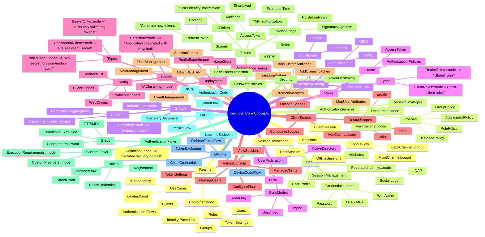
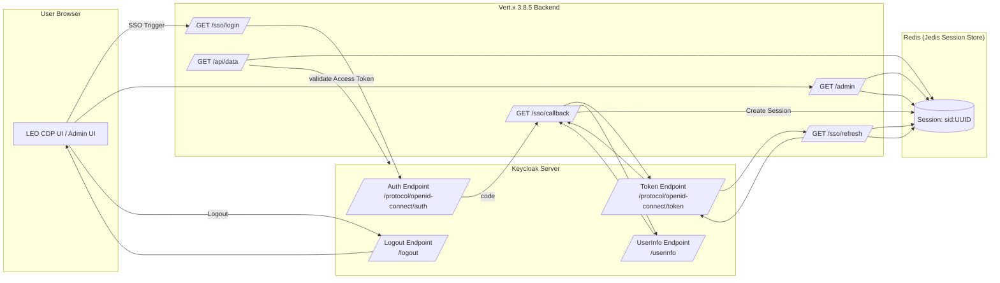
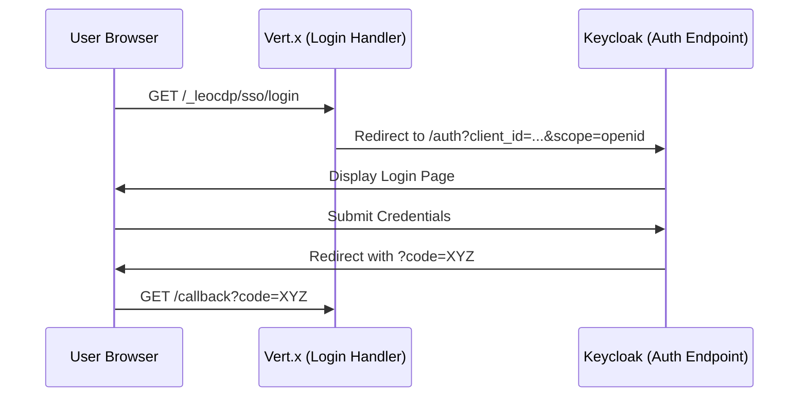
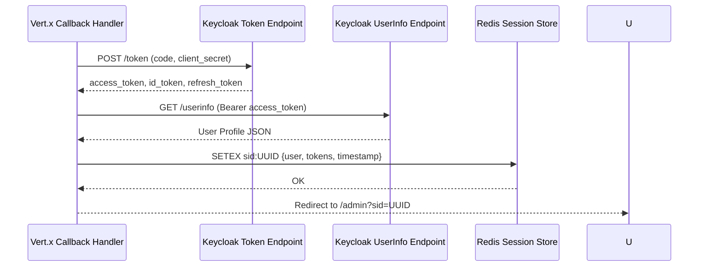
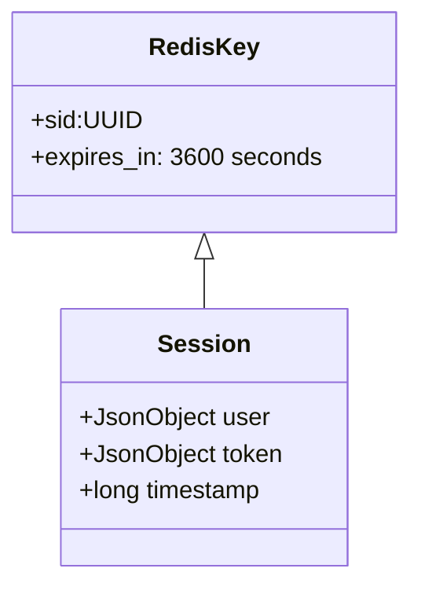
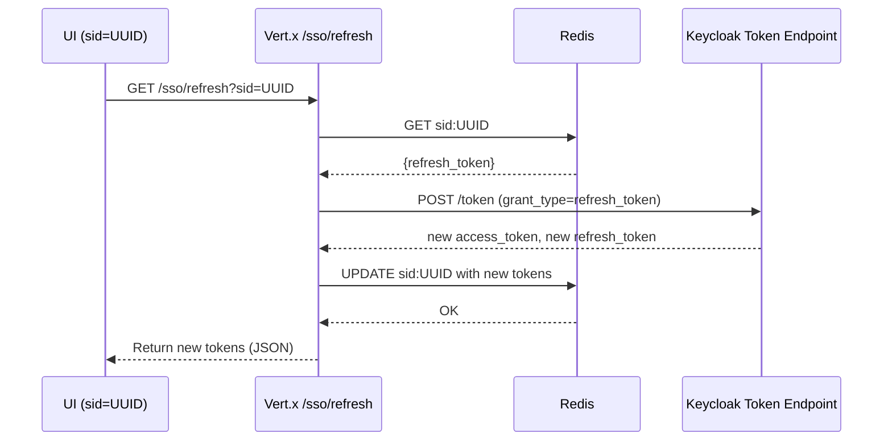
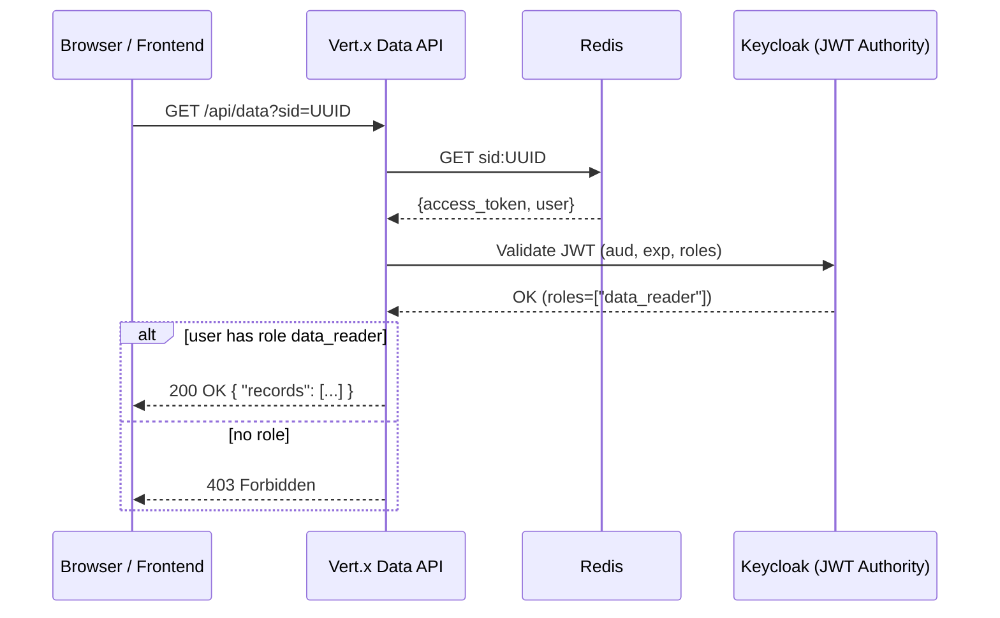

# 🌳 **Mermaid Mindmap — Keycloak Core Concepts**



---

# ✔ Mindmap includes every major Keycloak concept covered in the book:

* Realms
* Users & Groups
* Roles
* Clients
* Client Scopes
* Protocol Mappers
* OIDC/OAuth2 flows
* Tokens (ID/Access/Refresh)
* Authentication flows
* Sessions & Logout
* Authorization Services
* Identity Brokering
* User Federation
* Admin Console & REST API
* Deployment & Security Hardening


---

# ⭐ **CHEAT SHEET KEYCLOAK (2 TRANG) – FULL TEXT VERSION**

Bao gồm toàn bộ key concept + 2 flow minh họa riêng cho **LEO CDP** và **LEO BOT**.

---

# **📄 TRANG 1 — KEYCLOAK TỔNG QUAN & KHÁI NIỆM CỐT LÕI**

## **1. Realm**

* Không gian tách biệt để quản lý user, client, role, group, policy.
* Cho phép multi-tenant (nhiều hệ thống dùng chung 1 Keycloak).
  **Ví dụ:** `myrealm` cho hệ thống LEO CDP.

---

## **2. User**

* Tài khoản người dùng cuối.
* Có thể chứa profile, attribute tùy chỉnh, MFA, policy mật khẩu.
  **Ví dụ:** user marketer đăng nhập vào CDP Dashboard.

---

## **3. Client**

Ứng dụng đăng ký trong Keycloak: web app, backend API, mobile app, bot agent.

### **Hai loại client:**

* **Public Client** → không có secret (SPA, mobile app).
* **Confidential Client** → có secret (backend, server-side, bot, microservices).

**Ví dụ:**

* `leo-cdp-ui` (SPA → Public client)
* `leo-cdp-api` (Backend → Confidential)
* `leo-bot-agent` (Bot → Confidential, dùng Client Credentials)

---

## **4. Role**

* Quyền hạn (“vai trò”), dùng để phân quyền coarse-grained.

### Loại role:

* **Realm Role:** chung toàn hệ thống.
* **Client Role:** riêng cho từng ứng dụng.

**Ví dụ:**

* Realm role: `cdp_admin`, `cdp_marketer`.
* Client role: `api.read`, `api.write`.

---

## **5. Group**

* Gom user thành nhóm → áp dụng role cho cả nhóm.
  **Ví dụ:**
  Group `MarketingTeam` gồm: Huy, Trang, Quân → được gán `cdp_marketer`.

---

## **6. Client Scope**

* Gói thông tin (claims) được thêm vào token (ID/Access Token).
* Giúp quản lý token một cách modul hóa.

**Ví dụ:**

* Scope `profile+email` cho UI.
* Scope `segments.read` cho API.

---

## **7. Protocol Mapper**

* Cách ánh xạ dữ liệu vào token.
  **Ví dụ:**
* Thêm `user.picture` vào ID Token để UI hiển thị avatar.
* Thêm `aud=leo-cdp-api` vào Access Token.

---

## **8. Token**

Keycloak dùng **JWT**.

### **ID Token**

* Dùng cho UI → xác định “người dùng là ai”.

### **Access Token**

* Dùng cho API → xác định “người này được phép làm gì”.

### **Refresh Token**

* Dùng để lấy token mới mà không cần login lại.

**Mặc định ID/Access Token sống ~5 phút, Refresh Token sống lâu hơn.**

---

## **9. OIDC & OAuth2**

### **OIDC**

Dùng cho **authentication** (login người dùng).
→ Trả về *ID Token*.

### **OAuth2**

Dùng cho **authorization** (quyền truy cập API).
→ Trả về *Access Token*.

---

## **10. Authentication Flow**

* Kiểm soát quá trình login của người dùng.
* Có thể thêm OTP, WebAuthn, điều kiện logic.

---

## **11. Session & Logout**

### Keycloak hỗ trợ:

* **Single Logout**
* **Back-Channel Logout** (API và bot logout ngay lập tức)
* **Token Expiration**

---

## **12. Cấu hình Client bắt buộc**

* **Redirect URI:** nơi frontend nhận Authorization Code.
* **Web Origins:** CORS cho SPA.
* **Client Auth:** Bật cho backend/bot.
* **Consent Required:** Bật nếu muốn hỏi user cho phép quyền như Google OAuth.

---

---

# **📄 TRANG 2 — FLOW CHUẨN CHO LEO CDP & LEO BOT**

Dưới đây là flow **chi tiết**, giải thích logic để bạn triển khai đúng chuẩn OIDC/OAuth2.

---

# **FLOW 1 — LEO CDP LOGIN & API ACCESS (OIDC Authorization Code Flow + PKCE)**

Luồng dùng cho **Frontend UI (SPA)** + **Backend API**.

---

## **▶ Bước 1 — User mở LEO CDP (SPA UI)**

SPA không có secret → phải dùng OIDC Authorization Code Flow + PKCE.

---

## **▶ Bước 2 — SPA redirect user sang Keycloak**

SPA gửi request:

* `client_id=leo-cdp-ui`
* `redirect_uri=https://cdp.leo.app/callback`
* `response_type=code`
* `scope=openid profile email`
* `code_challenge` (PKCE)

Keycloak hiển thị trang login.

---

## **▶ Bước 3 — User đăng nhập**

Người dùng nhập email/mật khẩu hoặc dùng SSO (Google, HR system…).

Nếu bật MFA → Keycloak yêu cầu OTP/WebAuthn.

---

## **▶ Bước 4 — Keycloak trả về Authorization Code**

Keycloak redirect về SPA:
`https://cdp.leo.app/callback?code=xxx`

---

## **▶ Bước 5 — SPA gửi Authorization Code sang Backend Exchange Token**

SPA **không trực tiếp đổi token** (vì không có secret).
→ Gửi về backend:
`POST /auth/exchange`

Backend thực hiện:

* `client_id=leo-cdp-ui`
* `client_secret=XYZ`
* Authorization Code
* PKCE Verifier

Backend nhận được:

* **ID Token**
* **Access Token**
* **Refresh Token**

---

## **▶ Bước 6 — Backend gửi Access Token cho SPA**

Access Token sống ngắn (5 phút).
SPA lưu token trong memory (không lưu localStorage để tránh XSS leakage).

---

## **▶ Bước 7 — SPA gọi API LEO CDP**

SPA gửi request → Backend API:

```
Authorization: Bearer <AccessToken>
```

---

## **▶ Bước 8 — Backend API xác thực**

Backend API kiểm tra:

* Signature JWT (JWKS)
* `exp`, `iat`
* `aud = leo-cdp-api`
* Role/Scope: `cdp_marketer`, `segments.read`, `campaign.write`

Nếu ok → trả kết quả.

---

## **Flow tóm tắt:**

```
User → SPA (UI)
 → Redirect → Keycloak Login
 ← Authorization Code
SPA → Backend (Exchange Token)
 ← ID Token + Access Token
SPA → LEO CDP API (Bearer Token)
API → Validate Token
```

---

# **FLOW 2 — LEO BOT AGENT (Machine-to-Machine OAuth2 Client Credentials)**

Dùng cho **Bot tự động**, **AI Agent**, **Cron job**, **Background worker**, không có người dùng.

---

## **▶ Bước 1 — LEO BOT khởi động**

Bot có:

* `client_id = leo-bot-agent`
* `client_secret = xxxx`
* Scope được phép: `segments.read`, `events.ingest`, `automation.run`

---

## **▶ Bước 2 — BOT lấy Access Token từ Keycloak**

```
POST /token
client_id=leo-bot-agent
client_secret=xxxx
grant_type=client_credentials
scope=automation.run events.write
```

Keycloak trả về Access Token (JWT).

---

## **▶ Bước 3 — BOT gọi API LEO CDP**

```
Authorization: Bearer <AccessToken>
```

---

## **▶ Bước 4 — LEO CDP API kiểm tra token**

* Kiểm tra `aud = leo-cdp-api`
* Kiểm tra bot roles (client roles):

  * `automation.run`
  * `events.write`

Nếu hợp lệ → xử lý tác vụ bot.

---

## **Flow tóm tắt:**

```
LEO BOT → Keycloak (Client Credentials)
 ← Access Token
LEO BOT → LEO CDP API (Bearer Token)
API → Validate machine roles
```

Bot hoàn toàn không dùng ID Token vì không phải người dùng.

---

# Vert.x + Keycloak + Redis architecture

1. High-Level System Architecture
1. OIDC Authorization Code Login Flow
1. Token Exchange & UserInfo Flow
1. Redis Session Architecture
1. Token Refresh Flow
1. Role-Protected Data API Flow

## 1. High-Level System Architecture



## 2. OIDC Authorization Code Login Flow



## 3. Token Exchange + UserInfo Flow



## 4. Redis Session Architecture



```json
{
  "user": {
    "email": "student@example.com",
    "preferred_username": "studentA"
  },
  "token": {
    "access_token": "...",
    "refresh_token": "...",
    "id_token": "...",
    "expires_in": 300
  },
  "timestamp": 1700000000
}

```

## 5. Token Refresh Flow



## 6. Role-Protected Data API Flow

