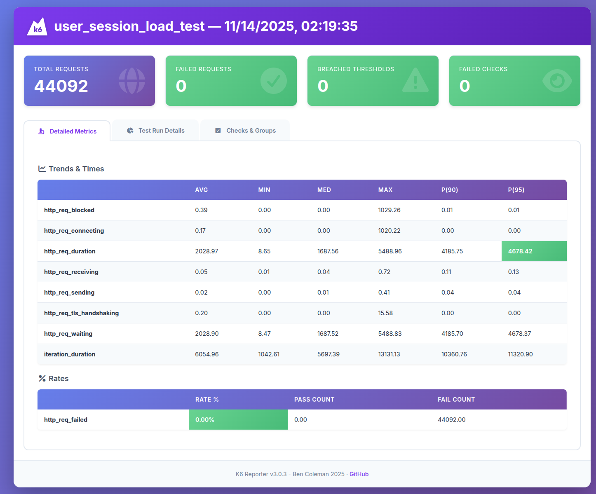
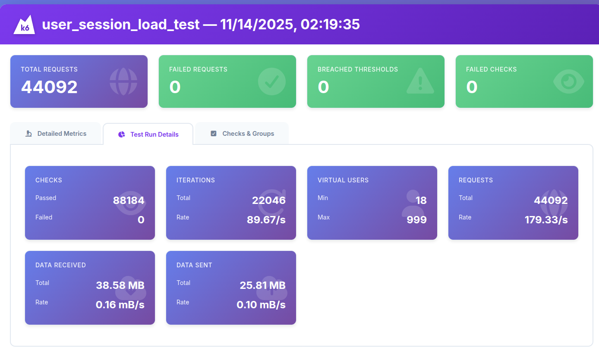

# 🔥 Giải thích logic toàn bộ code K6 (LEO CDP Load Test)

*Code: `tests_with_k6/user_session_load_test.js`*

Bài test này mô phỏng **hành vi duyệt web của user thật** khi truy cập các trang có gắn **LEO CDP Observer script**.
Mỗi VU (virtual user) được cấp:

* session riêng
* visitorId
* fingerprint
* user-agent khác nhau

Từ đó tạo ra traffic giống người thật gửi về hai endpoint:

* `cxs-pf-init` → gọi khi user mở trang lần đầu
* `etv` → page-view event

Load tăng theo từng stage và hệ thống bị ép chạy tối đa **1000 concurrent users**.

---

## 1) CẤU HÌNH CƠ BẢN

```js
const MAX_USER = 1000;
const CDP_HOSTNAME = "datahub4dcdp.bigdatavietnam.org";
```

---

## 2) QUẢN LÝ SESSION CHO TỪNG VIRTUAL USER

Toàn bộ VU dùng chung `sessionMap` để giữ session riêng:

```js
const sessionMap = {};
```

### createNewSession()

Tạo session giống hành vi thật:

* `visid` (visitorId)
* `fgp` (fingerprint)
* `ctxsk` (sessionKey rút gọn)
* `sessionStart` (timestamp)

### getSession(vu)

* Tạo mới nếu chưa có
* Reset nếu session sống quá 30 phút (giống timeout thực)

---

## 3) USER AGENT GIỐNG NGƯỜI THẬT

Mỗi user lấy 1 user-agent ngẫu nhiên (mobile + desktop + firefox).
Điều này giúp trẻ hóa dữ liệu về phía back-end, tránh việc hệ thống nhận toàn user-agent “ảo”.

---

## 4) STAGES — TĂNG TẢI DẦN LÊN 1000 USERS

```js
stages: [
    { duration: "10s", target: 200 },
    { duration: "20s", target: 250 },
    { duration: "30s", target: 333 },
    { duration: "60s", target: 500 },
    { duration: "120s", target: 1000 }
],
```

Mục tiêu cuối: **1000 VU chạy đồng thời**.

---

## 5) THRESHOLDS

Đảm bảo chất lượng:

* 95% request < **8 giây**
* Tỷ lệ lỗi < **1%**

Nếu vượt → đánh dấu fail.

---

## 6) REQUEST 1 — INIT SESSION (`cxs-pf-init`)

Gửi thông tin đầu vào khi user mở trang.
Bao gồm visitorId, fingerprint, mediahost, tpurl…

---

## 7) REQUEST 2 — PAGE VIEW (`etv`)

Gửi page-view sau khi trang load xong.

Thông tin gồm:

* referrer
* page title
* event payload
* visitorId + fingerprint + sessionKey

`sleep(1–3s)` tạo độ trễ giống người đọc trang.

---

## 8) REPORT

Sau khi chạy xong, k6 tạo report dạng HTML + summary.

---

# 🔍 PHÂN TÍCH BÁO CÁO LOAD TEST 1000 USERS

* Summary



* Details



Dựa trên report 1000 VU:

---

## 📌 Tổng request: **44,092**

Đây là số lượng request từ toàn bộ 1000 user trong thời gian test.
Con số này lành mạnh và ổn định, không có dấu hiệu nghẽn.

---

## 📌 Failed requests: **0**

Hệ thống **không rơi bất kỳ request nào**.
Điều này nghĩa là:

* Backend không timeout
* Không bị từ chối kết nối
* Không lỗi 5xx

---

## 📌 Breached thresholds: **0**

Không có vi phạm ngưỡng chất lượng:

* 95% request < 8 giây
* Tỷ lệ lỗi < 1%

Hệ thống pass toàn bộ điều kiện.

---

# 🔬 Báo cáo “Trends & Times” 1000 USERS

### 1. `http_req_duration (AVG ≈ 2028 ms)`

* Thời gian xử lý request trung bình: ~2 giây
* P90 = **4185 ms (~4.18s)**
* P95 = **4678 ms (~4.67s)**

Các giá trị này đều **nằm trong threshold 8 giây**, mặc dù tải đã tăng lên 1000 user.

👉 Tức là **95% request dưới 4.7 giây**, hoàn toàn ổn với hệ thống tracking event real-time.

---

### 2. `iteration_duration (AVG ≈ 6054 ms)`

Mỗi VU chạy 1 vòng:

* init
* pageview
* sleep

Độ dài ~6 giây là hợp lý.

---

### 3. `http_req_waiting = ~2028 ms`

Trùng với `http_req_duration`
→ network không phải bottleneck.
→ server là nơi xử lý chính, và hoạt động ổn định.

---

### 4. MAX = **5488 ms**

Ngay cả khi đạt đỉnh tải:

* Request nặng nhất chỉ ~5.5 giây
* Vẫn trong điều kiện pass (<8s)

---

# ⭐ KẾT LUẬN CHO TECH TEAM / PRODUCT TEAM LEO CDP (1000 USERS)

### 1. Hệ thống chịu được **1000 concurrent users**

Không lỗi, không timeout.

### 2. P95 ~4.6 giây

Đáp ứng tiêu chuẩn event tracking real-time của đa số website lớn.

### 3. Không vi phạm threshold

Đạt chuẩn production-grade.

### 4. Test mô phỏng người dùng thật (not synthetic spam)

* User-agent đa dạng
* Session thật
* Sleep delay hành vi
* Event format chuẩn LEO CDP

→ Giúp dữ liệu phản ánh gần production nhất.

### 5. Có thể tăng lên:

* **1500 VU**
* **2000 VU**
* hoặc chạy soak test 30–60 phút

để xác định giới hạn thực của hệ thống.
